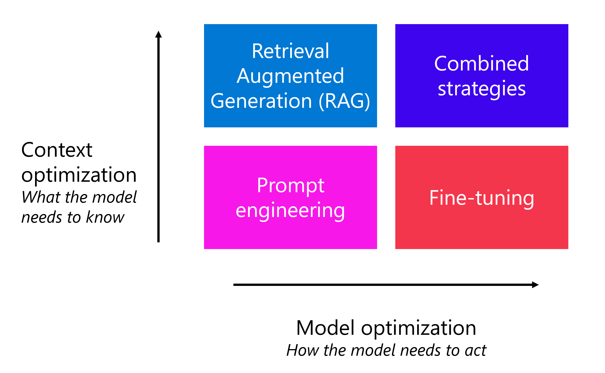

# [Choose and deploy models from the model catalog in Azure AI Foundry portal](https://learn.microsoft.com/en-us/training/modules/explore-models-azure-ai-studio/)

Choose the various language models that are available through the Azure AI Foundry's model catalog. Understand how to **select, deploy, and test a model**, and to **improve its performance**.

## Learning objectives

By the end of this module, you'll be able to:

- **Select a language model** from the model catalog.
- **Deploy a model to an endpoint**.
- **Test a model** and **improve the performance** of the model.

---

## Introduction

Generative AI applications are built on **language models**. The development process usually starts with an exploration and comparison of available foundation models to find the one that best suits the particular needs of your application. After selecting a suitable model, you deploy it to an endpoint where it can be consumed by a client application or AI agent.

Foundation models, such as the GPT family of models, are state-of-the-art language models designed to understand, generate, and interact with natural language. Some common use cases for models are:

- **Speech-to-text and text-to-speech conversion**. For example, generate subtitles for videos.
- **Machine translation**. For example, **translate text** from English to Japanese.
- **Text classification**. For example, **label an email as spam or not spam**.
- **Entity extraction**. For example, **extract keywords or names** from a document.
- **Text summarization**. For example, generate a short one-paragraph summary from a multi-page document.
- **Question answering**. For example, provide answers to questions like "What is the capital of France?"
- **Reasoning**. For example, solve a mathematical problem.

In this module, you focus on exploring **foundation models used for question answering**. The foundation models you explore can be used for chat applications in which you use a language model to generate a response to a user's question.

> Note: The latest breakthrough in generative AI models is owed to the development of the **Transformer** architecture. Transformers were introduced in the [**Attention is all you need** paper by Vaswani, et al. from 2017](https://arxiv.org/abs/1706.03762). The Transformer architecture provided two innovations to NLP that resulted in the emergence of foundation models:
> - Instead of processing words sequentially, Transformers process each word independently and in parallel by using **attention**.
> - Next to the semantic similarity between words, Transformers use **positional encoding** to include the information about the position of a word in a sentence.

---

## [Explore the model catalog](https://learn.microsoft.com/en-us/training/modules/explore-models-azure-ai-studio/2-select-model)

The **model catalog** in Azure AI Foundry provides a central repository of models that you can browse to find the right language model for your particular generative AI use case.

Selecting a foundation model for your generative AI app is important as it affects how well your app works. To find the best model for your app, you can **use a structured approach by asking yourself the following questions**:

- Can AI **solve** my use case?
- How do I **select** the best model for my use case?
- Can I **scale** for real-world workloads?

Let's explore each of these questions.

### Can AI solve my use case?

Nowadays we have thousands of language models to choose from. The main challenge is to understand if there's a model that satisfies your needs and to answer the question: *Can AI solve my use case?*

**To start answering this question, you need to discover, filter, and deploy a model**. You can explore the available language models through three different catalogs:

- [Hugging Face](https://huggingface.co/models): Vast catalog of open-source models across various domains.
- [GitHub](https://github.com/marketplace/models-github): Access to diverse models via GitHub Marketplace and GitHub Copilot.
- [Azure AI Foundry](https://ai.azure.com/explore/models): Comprehensive catalog with robust tools for deployment.

Though you can use each of these catalogs to explore models, the **model catalog in Azure AI Foundry** makes it easiest to explore and deploy a model to build you prototype, while offering the best selection of models.

Let's explore some of the options you need to consider when searching for suitable models.

#### Choose between large and small language models

First of all, you have a choice between **Large Language Models (LLMs)** and **Small Language Models (SLMs)**.

- LLMs like GPT-4, Mistral Large, Llama3 70B, Llama 405B, and Command R+ are powerful AI models designed for tasks that require **deep reasoning, complex content generation, and extensive context understanding**.
- SLMs like Phi3, Mistral OSS models, and Llama3 8B are efficient and cost-effective, while still handling many common Natural Language Processing (NLP) tasks. They're perfect for **running on lower-end hardware or edge devices**, where cost and speed are more important than model complexity.

#### Focus on a modality, task, or tool

Language models like GPT-4 and Mistral Large are also known as **chat completion models**, designed to generate coherent and contextually appropriate text-based responses. When you need higher levels of performance in complex tasks like math, coding, science, strategy, and logistics, you can also use **reasoning models** like DeepSeek-R1 and o1.

Beyond text-based AI, some models are **multi-modal**, meaning they can *process images, audio, and other data types alongside text*. Models like GPT-4o and Phi3-vision are capable of analyzing and generating both text and images. Multi-modal models are useful when your application needs to process and understand images, such as in computer vision or document analysis. Or when you want to build an AI app that interacts with visual content, such as a digital tutor explaining images or charts.

If your use case involves *generating images*, tools like DALL·E 3 and Stability AI can create realistic visuals from text prompts. **Image generation models** are great for designing marketing materials, illustrations, or digital art.

Another group of task-specific models are **embedding models** like Ada and Cohere. Embeddings models convert text into numerical representations and are used to improve search relevance by understanding semantic meaning. These models are often implemented in **Retrieval Augmented Generation (RAG)** scenarios to enhance recommendation engines by linking similar content.

When you want to build an application that interacts with other software tools dynamically, you can add function calling and JSON support. These capabilities allow AI models to work efficiently with structured data, making them useful for automating API calls, database queries, and structured data processing.

#### Specialize with regional and domain-specific models

**Certain models are designed for specific languages, regions, or industries**. These models can outperform general-purpose generative AI in their respective domains. For example:

- Core42 JAIS is an Arabic language LLM, making it the best choice for applications targeting Arabic-speaking users.
- Mistral Large has a strong focus on European languages, ensuring better linguistic accuracy for multilingual applications.
- Nixtla TimeGEN-1 specializes in **time-series forecasting**, making it ideal for financial predictions, supply chain optimization, and demand forecasting.

If your project has regional, linguistic, or industry-specific needs, these models can provide more relevant results than general-purpose AI.

#### Balance flexibility and performance with open versus proprietary models

You also need to **decide whether to use open-source models or proprietary models**, each with its own advantages.

**Proprietary models** are best for cutting-edge performance and enterprise use. Azure offers models like OpenAI’s GPT-4, Mistral Large, and Cohere Command R+, which deliver industry-leading AI capabilities. These models are ideal for businesses needing **enterprise-level security, support, and high accuracy**.

**Open-source models** are best for flexibility and cost-efficiency. There are hundreds of open-source models available in the Azure AI Foundry model catalog from Hugging Face, and models from Meta, Databricks, Snowflake, and Nvidia. Open models give developers **more control, allowing fine-tuning, customization, and local deployment**.

Whatever model you choose, you can use the Azure AI Foundry model catalog. Using models through the model catalog meets the key enterprise requirements for usage:

- **Data and privacy**: you get to decide what happens with your data.
- **Security and compliance**: built-in security.
- **Responsible AI and content safety**: evaluations and content safety.

Now you know the language models that are available to you, you should have an understanding of whether AI can indeed solve your use case. If you think a language model would enrich your application, you then need to select the specific model that you want to deploy and integrate.

### How do I *select* the best model for my use case?

To select the best language model for you use case, you need to decide on **what criteria you're using to filter the models**. The criteria are the necessary characteristics you identify for a model. **Four characteristics** you can consider are:

- **Task type**: What type of task do you need the model to perform? Does it include the understanding of only text, or also audio, or video, or multiple **modalities**?
- **Precision**: Is the base model good enough or do you need a fine-tuned model that is trained on a specific skill or dataset?
- **Openness**: Do you want to be able to fine-tune the model yourself?
- **Deployment**: Do you want to deploy the model locally, on a serverless endpoint, or do you want to manage the deployment infrastructure?

You already explored the various types of models available in the previous section. Now, let's explore in more detail how precision and performance can be important filters when choosing a model.

#### Filter models for precision

In generative AI, **precision refers to the accuracy of the model in generating correct and relevant outputs**. It measures the proportion of **true positive results (correct outputs) among all generated outputs**. High precision means fewer irrelevant or incorrect results, making the model more reliable.

When integrating a language model into an app, you can choose between a **base model** or a **fine-tuned model**. A base model, like GPT-4, is pretrained on a large dataset and can handle various tasks but can lack precision for specific domains. Techniques like prompt engineering can improve this, but sometimes fine-tuning is necessary.

**A fine-tuned model is trained further on a smaller, task-specific dataset** to improve its precision and ability to generate relevant outputs for specific applications. You can either use a fine-tuned model or fine-tune a model yourself.

#### Filter models for performance

You can evaluate your model performance at different phases, using various evaluation approaches.

When you're exploring models through the Azure AI Foundry model catalog, you can use **model benchmarks** to compare publicly available metrics like **coherence** and **accuracy** across models and datasets. These benchmarks can help you in the initial exploration phase, but give little information on how the model would perform in your specific use case.

| Benchmark | Description |
| -- | -- |
| **Accuracy** | Compares model-generated text with correct answer according to the dataset. Result is one if generated text matches the answer exactly, and zero otherwise. |
| **Coherence**|Measures whether the model output flows smoothly, reads naturally, and resembles human-like language.|
|**Fluency**|Assesses how well the generated text adheres to grammatical rules, syntactic structures, and appropriate usage of vocabulary, resulting in linguistically correct and natural-sounding responses.|
|**Groundedness**|Measures alignment between the model's generated answers and the input data.|
|**GPT Similarity**|Quantifies the semantic similarity between a ground truth sentence (or document) and the prediction sentence generated by an AI model.|
|**Quality index**|**A comparative aggregate score between 0 and 1**, with better-performing models scoring a higher value.|
|**Cost**|The cost of using the model based on a **price-per-token**. Cost is a useful metric with which to compare quality, enabling you to determine an appropriate tradeoff for your needs.|

To evaluate how a selected model performs regarding your specific requirements, you can consider manual or automated evaluations. **Manual evaluations** allow you to rate your model's responses. **Automated evaluations** include traditional machine learning metrics and AI-assisted metrics that are calculated and generated for you.

When you evaluate a model’s performance, it's common to start with manual evaluations, as they quickly assess the quality of the model’s responses. For more systematic comparisons, automated evaluations using metrics like **precision, recall, and F1 score** based on your own ground truth offer a faster, scalable, and more objective approach.

### Can I scale for real-world workloads?

You selected a model for your use case and have successfully built a prototype. Now, you need to understand how to scale for real-world workloads.

Considerations for scaling a generative AI solution include:

- **Model deployment**: Where will you deploy the model for the best balance of performance and cost?
- **Model monitoring and optimization**: How will you monitor, evaluate, and optimize model performance?
- **Prompt management**: How will you orchestrate and optimize prompts to maximize the accuracy and relevance of generated responses?
- **Model lifecycle**: How will you manage model, data, and code updates as part of an ongoing **Generative AI Operations (GenAIOps)** lifecycle?

Azure AI Foundry provides visual and code-first tools that can help you build and maintain a scalable generative AI solution.

---

## Deploy a model to an endpoint

When you develop a generative AI app, you need to **integrate language models into your application**. To be able to use a language model, you need to deploy the model. Let's explore how to deploy language models in the Azure AI Foundry, after first understanding why to deploy a model.

### Why deploy a model?

You train a model to generate output based on some input. To get value out of your model, you need a solution that allows you to **send input to the model, which the model processes, after which the output is visualized for you**.

With generative AI apps, the most common type of solution is a **chat application** that expects a user question, which the model processes, to generate an adequate response. The response is then visualized to the user as a response to their question.

You can integrate a language model with a chat application by deploying the model to an endpoint. **An endpoint is a specific URL where a deployed model or service can be accessed.** Each model deployment typically has its own unique endpoint, which allows different applications to **communicate with the model through an API (Application Programming Interface)**.

When a user asks a question:

- An API request is sent to the endpoint.
- The endpoint specifies the model that processes the request.
- The result is sent back to the app through an API response.

When you deploy a language model from the model catalog with the Azure AI Foundry, you get an endpoint, which consists of a **target URI (Uniform Resource Identifier)** and **a unique key**. For example, a target URI for a deployed GPT-3.5 model can be:

`https://ai-aihubdevdemo.openai.azure.com/openai/deployments/gpt-35-turbo/chat/completions?api-version=2023-03-15-preview`

The URI includes:

- Your **AI hub name**, for example `ai-aihubdevdemo`.
- Your **deployed model name**, for example `gpt-35-turbo`.
- The **task** for the model, for example `chat/completion`.

To protect your deployed models, each deployment comes with a **key**. You're only authorized to send and receive requests to and from the target URI, if you also provide the key to authenticate.

Now that you understand why you want to deploy a model, let's explore the deployment options with Azure AI Foundry.

### Deploy a language model with Azure AI Foundry

When you deploy a language model with Azure AI Foundry, you have several types available, which depend on the model you want to deploy.

You can deploy:

- [Azure OpenAI models](https://learn.microsoft.com/en-us/azure/ai-services/openai/concepts/models) like GPT-3.5 and GPT-4 with Azure OpenAI service and Azure AI model inference.
- Third-party models like DeepSeek-R1 as [Models as a Service](https://learn.microsoft.com/en-us/azure/ai-foundry/model-inference/concepts/models) as part of Azure AI model inference or with [serverless APIs](https://learn.microsoft.com/en-us/azure/ai-foundry/model-inference/concepts/models).
- Open and custom models like models from Hugging Face with your own [user-managed compute](https://learn.microsoft.com/en-us/azure/ai-foundry/how-to/model-catalog-overview#availability-of-models-for-deployment-as-managed-compute?azure-portal=true).

The associated cost depends on the type of model you deploy, which deployment option you choose, and what you are doing with the model:

| | Azure OpenAI Service | Azure AI Foundry Models | Serverless compute | Managed compute |
| -- | -- | -- | -- | -- |
| Supported models|Azure OpenAI models|**Flagship** models (including Azure OpenAI models and Models-as-a-service models)|Models-as-a-service models|Open and custom models|
| Hosting service|Azure OpenAI resource|Azure AI Services resource|AI Project resource|AI Project resource|
| Deployment cost|-|-|Minimal endpoint cost|Charged per minute|
| Inferencing cost|Token-based billing|Token-based billing|Token-based billing|-|

---

## Optimize model performance

After you deploy your model to an **endpoint**, you can start interacting with it to see how it works. Let's explore how you can use **prompt engineering** techniques to optimize your model's performance.

### Apply prompt patterns to optimize your model's output

*The quality of the questions you send to the language model, directly influences the quality of the responses you get back*. You can carefully construct your question, or prompt, to receive better and more interesting responses. **The process of designing and optimizing prompts to improve the model's performance is also known as prompt engineering**.

Prompt engineering requires users to **ask relevant, specific, unambiguous, and well-structured questions**, instructing the model to generate more accurate responses. To understand how to create well-defined prompts, let's explore some patterns that help you improve the output of a model:

- Instruct the model to act as a **persona**.
- Guide the model to **suggest better questions**.
- Provide a template to generate output in **a specific format**.
- Understand how a model reasons by asking it to reflect.
- Add context to improve the accuracy of the model's output.

As a developer, an effective approach is to add instructions to your deployed model in the form of a **system prompt**. The system prompt sets the model's behavior and allows you to guide the model without exposing the end user to the instructions. The best results are often achieved through the assignment of **an explicit system prompt and guidance (or templates)** that help users submit prompts that reflect the patterns described here.

#### Instruct the model to act as a persona

When you want the model to take a specific point of view or perspective when answering a question, you can ask it to act as a persona.

For example, you can ask the model to respond as if it's a seasoned marketing professional if you're working in sales and need insights about a new CRM software.

| | No persona specified | With persona specified |
| -- | -- | -- |
| System prompt|None|You're a seasoned marketing professional that writes advertising copy for an audience of technical customers.|
| User prompt| Write a one-sentence description of a CRM product.|Write a one-sentence description of a CRM product.|
|Model response|A CRM product is a software tool designed to manage a company's interactions with current and potential customers, encompassing sales, marketing, customer service, and technical support.|Experience seamless customer relationship management with our CRM product, designed to streamline your business operations, enhance customer interactions, and drive sales growth with its intuitive interface and robust analytics tools.|

You can create different personas for various business roles. Think of roles like a product manager, data analyst, customer service expert, or teacher. Define the persona and add more detail to what you expect that persona to know or do to get tailored, context-driven responses.

#### Ask for better question suggestions

When you want the model to help refine your question, you can ask it to suggest better ways to phrase your query. You can also ask it to provide extra context.

For example, if you're seeking advice on cooking a meal, you can prompt the model to suggest clarifying questions to help you get a more targeted answer.

| | No suggestions given | With suggestions given |
| -- | -- | -- |
| System prompt|You're an AI chef who can advise on menus.|You're an AI chef who can advise on menus. You're approachable and always want to provide the best advice you can.|
| User prompt|I have to host a dinner party for four people. What should I cook?|I have to host a dinner party for four people. What should I cook? **What other information do you need** to help me plan a great meal for my guests?|

When you encourage the model to suggest clarifications or extra details can help you ask the right questions and achieve better, more accurate answers in fewer interactions.

#### Specify the desired format for responses

When you want the model to generate output in a specific format, you can provide a template or structure in your prompt.

For example, if you're a sports reporting composing a historical article, you can request that the model follow **a specific template, which includes headings, bullet points, and data breakdowns**.

| | No template specified | With template specified |
| -- | -- | -- |
| System prompt	|You're a helpful AI assistant. |You're a helpful AI assistant for sports reporters.|
| User prompt|What happened in the 2018 Soccer World Cup final?|What happened in the 2018 Soccer World Cup final? Format the result to show the match date, location, and the two teams competing. Then the final score, and finally any notable events that occurred during the match.|

You can apply this approach to other scenarios where a specific format is needed, such as generating emails, summaries, proposals, or even code and scripts. Define the format template clearly and provide details on how you want the output structured to get consistent and organized responses.

You can also use a **one-shot or few-shots approach** by providing one or more examples to help the model identify a desired pattern.

#### Ask for an explanation of reasoning

When you want the model to explain the reasoning behind its answers, you can ask the model to automatically reflect on its rationale and assumptions after providing a response.

For example, if you're working on a mathematical problem, you can ask the model to explain the reasoning behind specific calculations.

| | No reflection specified | With reflection  specified |
| -- | -- | -- |
| System prompt |You're an AI math assistant. |You're an AI math assistant. **You always explain your answers**.|
| User prompt|A right-angled triangle has a hypotenuse side of length 3 cm and an adjacent side length of 2 cm. What is the length of the remaining side? |A right-angled triangle has a hypotenuse side of length 3 cm and an adjacent side length of 2 cm. What is the length of the remaining side?|

You can apply this approach when you want explanations in data analysis, marketing strategy, or technical troubleshooting. When you ask the model to define its reasoning, you use a technique called **chain-of-thought** to make it think step by step.

#### Add context

When you want the model to focus on specific topics, you can specify the context to consider. You can also tell the model to ignore irrelevant information.

For example, if you're planning a trip, you can provide the model with more context to help improve the relevance of its response.

| | No context  specified | With context specified |
| -- | -- | -- |
| System prompt |You're an AI travel assistant. |You're an AI travel assistant.|
| User question|When should I visit Edinburgh?|When should I visit Edinburgh? I'm particularly interested in attending Scotland's home matches in the Six Nations rugby tournament.|

By defining what the model should focus on or disregard, you can ensure the conversation stays on track and generate more relevant, tailored responses.

You can specify the context by **describing what it should or shouldn't include, and by connecting the model to data sources it should retrieve context from before generating an answer**.

### Apply model optimization strategies

> Note: This section discusses options and considerations for model optimization that you may consider beyond prompt engineering. A full exploration of how to apply these optimization strategies is beyond the scope of this module.

Prompt engineering can be an effective way to optimize model responses, but in some cases it may not provide sufficient context or guidance to always meet your exact needs. As a developer, you can consider the following additional optimization strategies to improve the relevance of your generative AI application's responses:

- **Retrieval Augmented Generation (RAG)**: A technique that involves using a data source to provide grounding context to prompts. RAG can be a useful approach when you need the model to **answer questions based on a specific knowledge domain** or **when you need the model to consider information related to events that occurred after the training data on which the model is based**.
- **Fine-tuning**: A technique that involves extending the training of a foundation model by **providing example prompts and responses that reflect the desired output format and style**.

Both of these approaches involve additional cost, complexity, and maintainability challenges, so as a general rule **it's best to start your optimization efforts through prompt engineering, and then consider additional strategies if necessary**.

The strategy you should choose as a developer depends on your requirements:

[image](https://learn.microsoft.com/en-us/training/wwl-data-ai/explore-models-azure-ai-studio/media/model-optimization.png)

- **Optimize for context**: When the model ***lacks contextual knowledge*** and you want to maximize responses accuracy.
- **Optimize the model**: When you want to **improve the response format, style, or speech** by maximizing consistency of behavior.

To optimize for context, you can apply a **Retrieval Augmented Generation (RAG)** pattern. With RAG, you ground your data by first retrieving context from a data source before generating a response. For example, you want employees to ask questions about expense claim processes and limits based on your own corporation's expenses policy documentation.

When you want the model to respond in a specific style or format, you can instruct the model to do so by adding guidelines in the system message. When you notice the model's behavior isn't consistent, you can further enforce consistency in behavior by fine-tuning a model. With **fine-tuning**, you **train a base language model on a dataset of example prompts and responses** before integrating it in your application, with the result that the fine-tuned model will produce responses that are consistent with the examples in the fine-tuning training dataset.

You can use any combination of optimization strategies, for example **prompt engineering, RAG and a fine-tuned model**, to improve your language application.

---

## [Exercise - Explore, deploy, and chat with language models](https://learn.microsoft.com/en-us/training/modules/explore-models-azure-ai-studio/5-exercise)

### [Choose and deploy a language model](https://microsoftlearning.github.io/mslearn-ai-studio/Instructions/02-Explore-model-catalog.html)

The Azure AI Foundry model catalog serves as a central repository where you can explore and use a variety of models, facilitating the creation of your generative AI scenario.

In this exercise, you’ll explore the model catalog in Azure AI Foundry portal, and compare potential models for a generative AI application that assists in solving problems.

---

## Module assessment

1. Where can you test a deployed model in the Azure AI Foundry portal? **Chat playground**
2. You want to **specify the tone, format, and content** for each interaction with your model in the playground. What should you use to customize the model response? **System message**
3. What deployment options for an OpenAI model incur no cost for deployment and charge for inferencing based on token-based billing? **Either Azure OpenAI service or Azure AI Model Inferencing Service**

---

## Summary

In this module, you learned how to:

- Select a language model from the model catalog.
- Deploy a model to an endpoint.
- Test a model and improve the performance of the model.
