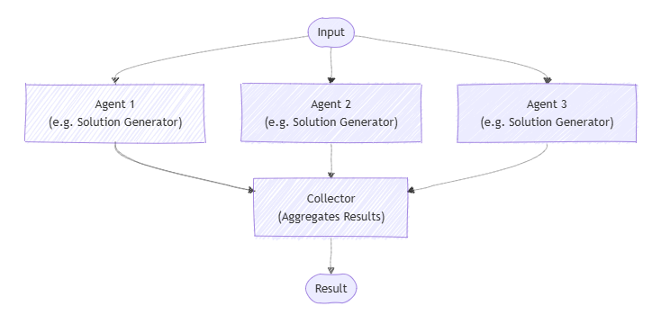
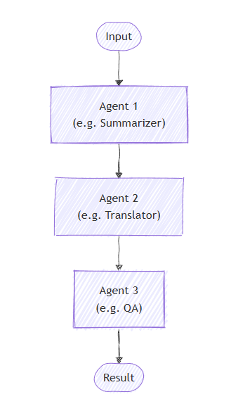
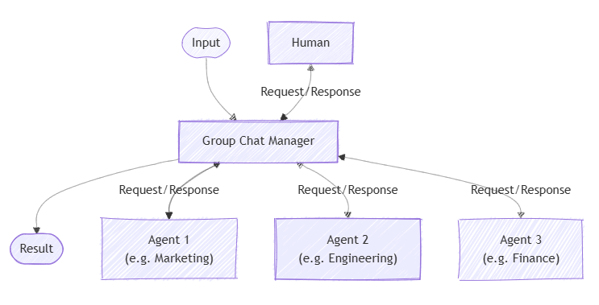
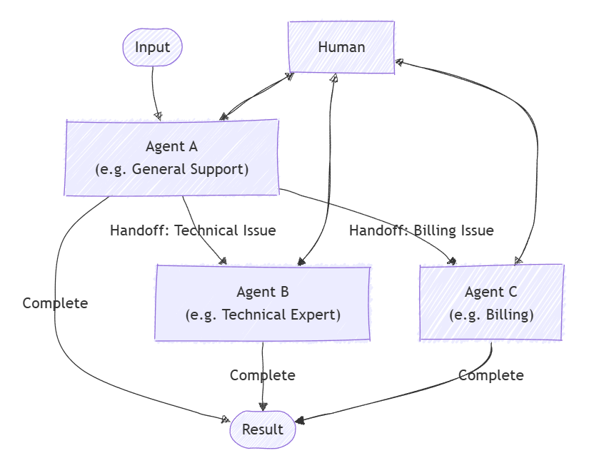
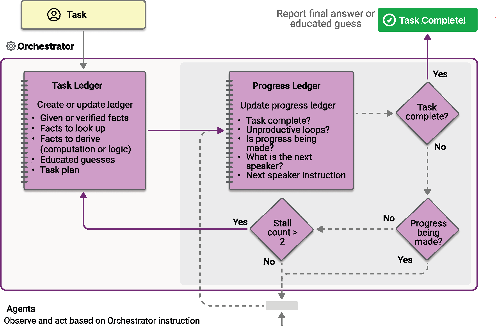

# [Orchestrate a multi-agent solution using the Microsoft Agent Framework](https://learn.microsoft.com/en-us/training/modules/orchestrate-semantic-kernel-multi-agent-solution/)

Learn how to use the **Microsoft Agent Framework SDK** to develop your own AI agents that can collaborate for a multi-agent solution.

## Learning objectives

By the end of this module, you'll be able to:

- Build AI agents using the Microsoft Agent Framework SDK
- Understand **how and when to use different orchestration patterns**
- Develop multi-agent solutions

---

## Introduction

AI agents offer a powerful combination of technologies, able to complete tasks with the use of generative AI. However, in some situations, the task required might be larger than is realistic for a single agent. For those scenarios, consider a **multi-agent solution**. A multi-agent solution allows agents to collaborate within the same conversation.

Imagine you're trying to address common DevOps challenges such as monitoring application performance, identifying issues, and deploying fixes. A multi-agent system could consist of four specialized agents working collaboratively:

- The **Monitoring Agent** continuously ingests logs and metrics, detects anomalies using natural language processing (NLP), and triggers alerts when issues arise.
- The **Root Cause Analysis Agent** then correlates these anomalies with recent system changes, using machine learning models or predefined rules to pinpoint the root cause of the problem.
- Once the root cause is identified, the **Automated Deployment Agent** takes over to implement fixes or roll back problematic changes by interacting with CI/CD pipelines and executing deployment scripts.
- Finally, the **Reporting Agent** generates detailed reports summarizing the anomalies, root causes, and resolutions, and notifies stakeholders via email or other communication channels.

This modular, scalable, and intelligent multi-agent system streamlines the DevOps process. The agents collaborate to reduce manual intervention and improve efficiency while ensuring timely communication and resolution of issues.

In this module, you'll explore how to use the powerful capabilities of the Microsoft Agent Framework to design and orchestrate intelligent agents that work collaboratively to solve complex problems. You'll also learn about the **different types of orchestration patterns** available, and use the Microsoft Agent Framework to develop your own AI agents that can collaborate for a multi-agent solution.

After completing this module, you'll be able to:

- Build AI agents using the **Microsoft Agent Framework SDK**
- Use tools and plugins with your AI agents
- Understand different types of orchestration patterns
- Develop multi-agent solutions

---

## Understand the Microsoft Agent Framework

**The Microsoft Agent Framework is an open-source SDK that enables developers to integrate AI models into their applications**. This framework provides comprehensive support for creating AI-powered agents that can work independently or collaborate with other agents to accomplish complex tasks.

### What is the Microsoft Agent Framework?

The Microsoft Agent Framework is designed to help developers build AI-powered agents that can process user inputs, make decisions, and execute tasks autonomously by leveraging large language models and traditional programming logic. The framework provides structured components for defining AI-driven workflows, enabling agents to interact with users, APIs, and external services seamlessly.

#### Core concepts

The Microsoft Agent Framework provides a flexible architecture with the following key components:

- **Agents**: Agents are intelligent, AI-driven entities capable of reasoning and executing tasks. They use large language models, tools, and conversation history to make decisions dynamically and respond to user needs.

- **Agent orchestration**: Multiple agents can collaborate towards a common goal using different **orchestration patterns**. The Microsoft Agent Framework supports several orchestration patterns with a unified interface for construction and invocation, allowing you to easily switch between patterns without rewriting your agent logic.

The framework includes several core features that power agent functionality:

- **Chat clients**: Chat clients provide abstractions for connecting to AI services from different providers under a common interface. Supported providers include Azure OpenAI, OpenAI, Anthropic, and more through the `BaseChatClient` abstraction.

- **Tools and function integration**: Tools enable agents to extend their capabilities through custom functions and built-in services. Agents can automatically invoke tools to integrate with external APIs, execute code, search files, or access web information. The framework supports both **custom function tools and built-in tools** like *Code Interpreter, File Search, and Web Search*.

- **Conversation management**: Agents can maintain conversation history across multiple interactions using `AgentThread`, allowing them to track previous interactions and adapt responses accordingly. The structured message system uses **roles (USER, ASSISTANT, SYSTEM, TOOL)** for persistent conversation context.

#### Types of agents

The Microsoft Agent Framework supports several different types of agents from multiple providers:

- **Azure AI Foundry Agent** - a specialized agent within the Microsoft Agent Framework designed to provide enterprise-grade conversational capabilities with seamless tool integration. It automatically handles tool calling and securely **manages conversation history using threads**, reducing the overhead of maintaining state. Azure AI Foundry Agents support built-in tools and provide integration capabilities for Azure AI Search, Azure Functions, and other Azure services.

- **ChatAgent**: designed for general conversation and task completion interfaces. The `ChatAgent` type provides natural language processing, contextual understanding, and dialogue management with support for custom tools and instructions.

- **OpenAI Assistant Agent**: designed for advanced capabilities using **OpenAI's Assistant API**. This agent type supports goal-driven interactions with features like code interpretation and file search through the OpenAI platform.

- **Anthropic Agent**: provides access to **Anthropic's Claude models** with the framework's unified interface, supporting advanced reasoning and conversation capabilities.

### Why you should use the Semantic Kernel Agent Framework

The Microsoft Agent Framework offers a robust platform for building intelligent, autonomous, and collaborative AI agents. **The framework can integrate agents from multiple sources, including Azure AI Foundry Agent Service, and supports both multi-agent collaboration and human-agent interaction**. Agents can work together to orchestrate sophisticated workflows, where each agent specializes in a specific task, such as data collection, analysis, or decision-making. The framework also facilitates human-in-the-loop processes, enabling agents to augment human decision-making by providing insights or automating repetitive tasks. The provider-agnostic design allows you to switch between different AI providers without changing your code, making it suitable for building adaptable AI systems from simple chatbots to complex enterprise solutions.

---

## Understand agent orchestration

The **Microsoft Agent Framework SDK's agent orchestration framework** makes it possible to design, manage, and scale complex multi-agent workflows without having to manually handle the details of agent coordination. Instead of relying on a single agent to manage every aspect of a task, you can combine multiple specialized agents. Each agent with a unique role or area of expertise can collaborate to create systems that are more robust, adaptive, and capable of solving real-world problems collaboratively.

By orchestrating agents together, you can take on tasks that would be too complex for a single agent—from running parallel analyses, to building multi-stage processing pipelines, to managing dynamic, context-driven handoffs between experts.

### Why multi-agent orchestration matters

Single-agent systems are often limited in scope, constrained by one set of instructions or a single model prompt. Multi-agent orchestration addresses this limitation by allowing you to:

- **Assign** distinct skills, responsibilities, or perspectives to each agent.
- **Combine outputs** from multiple agents to improve decision-making and accuracy.
- **Coordinate steps in a workflow** so each agent’s work builds on the last.
- **Dynamically route control** between agents based on context or rules.

This approach opens the door to more flexible, efficient, and scalable solutions, especially for real-world applications that require collaboration, specialization, or redundancy.

### Supported orchestration patterns

Microsoft Agent Framework provides several orchestration patterns directly in the SDK, each offering a different approach to coordinating agents. These patterns are designed to be technology-agnostic so you can adapt them to your own domain and integrate them into your existing systems.

- **Concurrent orchestration** - Broadcast the same task to multiple agents at once and collect their results independently. Useful for **parallel analysis**, independent subtasks, or ensemble decision making.
- **Sequential orchestration** - Pass the output from one agent to the next in a fixed order. Ideal for **step-by-step** workflows, pipelines, and progressive refinement.
- **Handoff orchestration** - **Dynamically transfer control** between agents based on context or rules. Great for escalation, fallback, and expert routing where one agent works at a time.
- **Group chat orchestration** - Coordinate a shared conversation among multiple agents (and optionally a human), managed by a chat manager that chooses who speaks next. Best for **brainstorming**, collaborative problem solving, and building consensus.
- **Magentic orchestration** - A manager-driven approach that plans, delegates, and adapts across specialized agents. Suited to **complex, open-ended problems** where the solution path evolves.

### A unified orchestration workflow

Regardless of which orchestration pattern you choose, the Microsoft Agent Framework SDK provides a consistent, developer-friendly interface for building and running them. The typical flow looks like this:

1. **Define your agents** and describe their capabilities.
2. **Select and create an orchestration pattern**, optionally adding a manager agent if needed.
3. **Optionally configure callbacks or transforms** for custom input and output handling.
4. **Start a runtime** to manage execution.
5. **Invoke the orchestration** with your task.
6. **Retrieve results** in an **asynchronous**, nonblocking way.

Because all patterns share the same core interface, you can easily experiment with different orchestration strategies without rewriting agent logic or learning new APIs. The SDK abstracts the complexity of agent communication, coordination, and result aggregation so you can focus on designing workflows that deliver results.

Multi-agent orchestration in the Microsoft Agent Framework SDK provides a flexible, scalable way to build intelligent systems that combine the strengths of multiple specialized agents. With built-in orchestration patterns, a unified development model, and runtime features for managing execution, you can quickly prototype, refine, and deploy collaborative AI workflows. The framework provides the tools to turn multiple agents into a cohesive problem-solving team, whether you're running parallel processes, sequential workflows, or dynamic conversations.

---

## Use concurrent orchestration

Concurrent orchestration lets multiple agents work on the same task at the same time. **Each agent handles the task independently, and then their outputs are gathered and combined**. This method works especially well when you want diverse approaches or solutions, like during **brainstorming, group decision-making, or voting**.

This pattern is useful when you need different approaches or ideas to solve the same problem. Instead of having agents work one after another, they **all work at the same time**. This speeds up the process and covers the problem from many angles.

Usually, the results from each agent are combined to create a final answer, but this isn’t always necessary. Each agent can also produce its own separate result, like calling tools to complete tasks or updating different data stores independently.

Agents work on their own and don't share results with each other. However, an agent can call other AI agents by running its own orchestration as part of its process. Agents need to know which other agents are available to work on tasks. This pattern allows you to either call all registered agents every time or choose which agents to run based on the specific task.

### When to use concurrent orchestration

You may want to consider using the concurrent orchestration pattern in these situations:

- When tasks can run at the same time, either by using a fixed group of agents or by selecting AI agents dynamically based on what the task needs.
- When the task benefits from different specialized skills or approaches (for example, technical, business, or creative) that all work independently but contribute to solving the same problem.

This kind of teamwork is common in multi-agent decision-making methods such as:

- Brainstorming ideas
- Combining different reasoning methods (ensemble reasoning)
- Making decisions based on voting or consensus (quorum)
- Handling tasks where speed matters and running agents in parallel cuts down wait time

### When to avoid concurrent orchestration

You may want to avoid using the concurrent orchestration pattern in the following scenarios:

- Agents need to build on each other's work or **depend on shared context** in a specific order.
- The task requires a **strict sequence** of steps or predictable, repeatable results.
- Resource limits, like model usage quotas, make running agents in parallel inefficient or impossible.
- Agents can't reliably coordinate changes to shared data or external systems while running at the same time.
- There's **no clear way to resolve conflicts or contradictions** between results from different agents.
- Combining results is too complicated or ends up lowering the overall quality.

### Implement concurrent orchestration

Implement the concurrent orchestration pattern with the Microsoft Agent Framework:

1. **Create your chat client**: Set up a chat client (for example, `AzureOpenAIChatClient`) with appropriate credentials to connect to your AI service provider.

2. **Define your agents**: Create agent instances using the chat client's `create_agent` method. Each agent should have specific instructions and a name that defines its role and expertise area.

3. **Build the concurrent workflow**: Use the `ConcurrentBuilder` class to create a workflow that can run multiple agents in parallel. Add your agent instances as participants using the `participants()` method, then call `build()` to create the workflow.

4. **Run the workflow**: Call the workflow's `run` method with the task or input you want the agents to work on. The workflow runs all agents concurrently and returns events containing the results.

5. **Process the results**: Extract the outputs from the workflow events using `get_outputs()`. The results contain the combined conversations from all agents, with each agent's response included in the final output.

6. **Handle the aggregated responses**: Process the aggregated messages from all agents. **Each message includes the author name and content**, allowing you to identify which agent provided each response.

Concurrent orchestration is a powerful pattern for using multiple AI agents **simultaneously**, enabling faster and more diverse problem-solving. By running agents in parallel, you can explore different approaches at once, improve efficiency, and gain richer insights. However, it's important to choose this pattern when tasks can truly run independently and to be mindful of resource constraints and coordination challenges. When implemented thoughtfully with the Microsoft Agent Framework SDK, concurrent orchestration can greatly enhance your AI workflows and decision-making processes.

---

## Use sequential orchestration

In sequential orchestration, agents are arranged in a **pipeline** where each agent processes the task one after another. **The output from one agent becomes the input for the next**. This pattern is ideal for workflows where each step depends on the previous one, such as document review, data transformation pipelines, or multi-stage reasoning.

Sequential orchestration works best for tasks that need to be done **step-by-step**, with each step improving on the last. The order in which agents run is fixed and decided beforehand, and agents don't decide what happens next.

### When to use sequential orchestration

Consider using the sequential orchestration pattern when your workflow has:

- Processes made up of **multiple steps** that must happen in a **specific order**, where each step relies on the one before it.
- Data workflows where each stage adds something important that the next stage needs to work properly.
- Tasks where stages can't be done at the same time and must run one after another.
- Situations that require **gradual improvements**, like drafting, reviewing, and polishing content.
- Systems where you know how each agent performs and can handle delays or failures in any step without stopping the whole process.

### When to avoid sequential orchestration

Avoid this pattern when:

- **Stages can be run independently and in parallel** without affecting quality.
- A single agent can perform the entire task effectively.
- Early stages may fail or produce poor output, and there's no way to stop or correct downstream processing based on errors.
- Agents need to collaborate dynamically rather than hand off work sequentially.
- The workflow requires iteration, backtracking, or dynamic routing based on intermediate results.

### Implement sequential orchestration

Implement the sequential orchestration pattern with the Microsoft Agent Framework SDK:

1. **Create your chat client**: Set up a chat client (for example, `AzureOpenAIChatClient`) with appropriate credentials to connect to your AI service provider.

2. **Define your agents**: Create agent instances using the chat client's `create_agent` method. Each agent should have specific instructions and a name that defines its role and expertise area in the pipeline.

3. **Build the sequential workflow**: Use the `SequentialBuilder` class to create a workflow that executes agents one after another. Add your agent instances as participants using the `participants()` method, then call `build()` to create the workflow.

4. **Run the workflow**: Call the workflow's `run_stream` method with the task or input you want the agents to work on. The workflow processes the task through all agents sequentially, with each agent's output becoming input for the next.

5. **Process the workflow events**: Iterate through the workflow events using an async loop. Look for `WorkflowOutputEvent` instances, which contain the results from the sequential processing.

6. **Extract the final conversation**: Collect the final conversation from the workflow outputs. The result contains the complete conversation history showing how each agent in the sequence contributed to the final outcome.

Sequential orchestration is ideal when your task requires clear, ordered steps where each agent builds on the previous one's output. This pattern helps improve output quality through stepwise refinement and ensures predictable workflows. When applied thoughtfully with the Microsoft Agent Framework SDK, it enables powerful multi-agent pipelines for complex tasks like content creation, data processing, and more.

---

## Use group chat orchestration

Group chat orchestration models a collaborative conversation among multiple AI agents, and optionally a human participant. A central chat manager controls the flow, deciding which agent responds next and when to request human input. This pattern is useful for simulating meetings, debates, or collaborative problem-solving.

The group chat pattern works well for scenarios where **group discussion** or **iterative collaboration** is key to reaching decisions. It supports different interaction styles, from free-flowing ideation to formal workflows with defined roles and approval steps. Group chat orchestration is also great for **human-in-the-loop** setups where a human may guide or intervene in the conversation. Typically, agents in this pattern don't directly change running systems—they mainly contribute to the conversation.

### When to use group chat orchestration

Consider using group chat orchestration when your scenario involves:

- Spontaneous or guided collaboration among agents (and possibly humans)
- Iterative maker-checker loops where agents take turns creating and reviewing
- **Real-time human oversight or participation**
- Transparent and auditable conversations since **all output is collected in a single thread**

Common scenarios include:

- Creative brainstorming where agents build on each other's ideas
- Decision-making that benefits from debate and consensus
- Complex problems requiring cross-disciplinary dialogue
- Quality control and validation requiring multiple expert perspectives
- Content workflows with clear separation between creation and review

### When to avoid group chat orchestration

Avoid this pattern when:

- Simple task delegation or straightforward linear pipelines suffice
- Real-time speed requirements make discussion overhead impractical
- Hierarchical or deterministic workflows are needed without discussion
- The chat manager can't clearly determine when the task is complete
- Managing conversation flow becomes too complex, especially with many agents (limit to three or fewer for easier control)

### Maker-checker loops

A common special case is the maker-checker loop. Here, **one agent (the maker) proposes content or solutions, and another agent (the checker) reviews and critiques them**. The checker can send feedback back to the maker, and this cycle repeats until the result is satisfactory. **This process requires a turn-based sequence managed by the chat manager**.

### Implement group chat orchestration

Implement the group chat orchestration pattern with the Microsoft Agent Framework SDK:

1. **Create your chat client**: Set up a chat client (for example, `AzureOpenAIChatClient`) with appropriate credentials to connect to your AI service provider.

2. **Define your agents**: Create agent instances using the chat client's `create_agent` method. Each agent should have **specific instructions and a name** that defines its role and expertise area.

3. **Build the group chat workflow**: Use the `GroupChatBuilder` class to create a workflow that can run multiple agents in parallel. Add your agent instances as participants using the `participants()` method, then call `build()` to create the workflow.

4. **Run the workflow**: Call the workflow's `run` method with the task or input you want the agents to work on. The workflow runs all agents concurrently and returns events containing the results.

5. **Process the results**: Extract the outputs from the workflow events using `get_outputs()`. The results contain the combined conversations from all agents, with each agent's response included in the final output.

6. **Handle the aggregated responses**: Process the aggregated messages from all agents. Each message includes the author name and content, allowing you to identify which agent provided each response.

### Customizing the group chat manager

You can create a custom group chat manager by extending the base `GroupChatManager` class. This approach lets you control:

- How conversation results are filtered or summarized
- How the next agent is selected
- When to request user input
- When to terminate the conversation

Custom managers let you implement specialized logic tailored to your use case.

### Group chat manager call order

During each round of the conversation, the chat manager calls methods in this order:

1. `should_request_user_input` - Checks if human input is needed before the next agent responds.
2. `should_terminate` - Determines if the conversation should end (for example, max rounds reached).
3. `filter_results` - If ending, summarizes or processes the final conversation.
4. `select_next_agent` - If continuing, chooses the next agent to speak.

This ensures user input and termination conditions are handled before moving the conversation forward. Override these methods in your custom manager to change behavior.

Group chat orchestration enables multiple AI agents—and optionally humans—to collaborate through guided conversation and iterative feedback. It's ideal for complex tasks that benefit from diverse expertise and dynamic interaction. While it requires careful management, this pattern offers transparency and flexibility in decision-making and creative workflows. The Microsoft Agent Framework SDK makes it easy to implement and customize group chat orchestration for your needs.

---

## Use handoff orchestration

**Handoff orchestration lets AI agents transfer control to one another based on the task context or user requests**. Each agent can "handoff" the conversation to another agent with the right expertise, **making sure the best-suited agent handles each part of the task**. This pattern is ideal for customer support, expert systems, or any situation where dynamic delegation is needed.

This pattern fits scenarios where the best agent isn't known upfront or where the task requirements become clearer during processing. Unlike parallel patterns, agents work one at a time, fully handing off control from one to the next.

### When to use handoff orchestration

You may want to consider using the handoff orchestration pattern in these scenarios:

- Tasks need specialized knowledge or tools, but the number or order of agents can't be determined in advance.
- Expertise requirements emerge dynamically during processing, triggering task routing based on content analysis.
- Multiple-domain problems require different specialists working sequentially.
- You can define clear signals or rules indicating when an agent should transfer control and to whom.

### When to avoid handoff orchestration

You may want to avoid using the handoff orchestration pattern in these scenarios:

- The involved agents and their order are known upfront and fixed.
- Task routing is simple and rule-based, not needing dynamic interpretation.
- Poor routing decisions might frustrate users.
- Multiple operations must run at the same time.
- Avoiding infinite handoff loops or excessive bouncing between agents is difficult.

### Implementing handoff orchestration

The handoff orchestration pattern can be implemented in the Microsoft Agent Framework SDK using control workflows. In a control workflow, each agent processes the task in sequence, and based on its output, the **workflow decides which agent to call next**. This routing is done using a **switch-case structure** that routes the task to different agents based on classification results.

1. **Set up data models and chat client**:

   - Create your chat client for connecting to AI services
   - Define Pydantic models for AI agents' structured JSON responses
   - Create simple data classes for passing information between workflow steps
   - Configure agents with specific instructions and `response_format` parameter for structured JSON output

2. **Create specialized executor functions**:

   - **Input storage executor** - saves incoming data to shared state and forwards to classification agent
   - **Transformation executor** - converts agent's JSON response into typed routing object
   - **Handler executors** - separate executors for each classification outcome with guard conditions to verify correct message processing

3. **Build routing logic**:

   - Create factory functions that generate condition checkers for each classification value
   - Design conditions to examine incoming messages and return true for specific classification results
   - Use conditions with Case objects in **switch-case edge groups**
   - Always include **a Default case as fallback** for unexpected scenarios

4. **Assemble the workflow**:

   - Use WorkflowBuilder to connect executors with regular edges
   - Add switch-case edge group for routing based on classification results
   - Configure workflow to follow first matching case or fall back to default
   - Set up **terminal executor** to yield final output

Handoff orchestration provides a flexible way to route tasks dynamically among specialized AI agents, ensuring that each part of a workflow is handled by the **best-suited expert**. It works well for complex, evolving tasks like **customer support or multi-domain problem solving** where expertise needs change during the conversation. When you use the Microsoft Agent Framework SDK, you can build adaptable systems that seamlessly transfer control between agents—and include human input when needed—for smooth and efficient task completion.

---

## Use Magentic orchestration

Magentic orchestration is a flexible, **general-purpose multi-agent pattern** **designed for complex, open-ended tasks that require dynamic collaboration**. This pattern uses a dedicated Magentic manager to coordinate a team of specialized agents. The manager decides which agent should act next based on the evolving context, task progress, and agent capabilities.

**The Magentic manager maintains a shared context, tracks progress, and adapts the workflow in real time**. This approach allows the system to break down complex problems, assign subtasks, and iteratively refine solutions. The process focuses as much on building and documenting the approach as it does on delivering the final solution. A dynamic task ledger is built and refined as the workflow progresses, recording goals, subgoals, and execution plans.

### When to use Magentic orchestration

Consider using the Magentic orchestration pattern in these scenarios:

- **The problem is complex or open-ended with no predetermined solution path**.
- Input and feedback from multiple specialized agents are needed to shape a valid solution.
- **The system must generate a documented plan of approach for human review**.
- Agents have tools that can directly interact with external systems and resources.
- A step-by-step, dynamically built execution plan adds value before running the tasks.

### When to avoid Magentic orchestration

You may want to avoid this pattern when:

- The solution path is fixed or deterministic.
- There's no need to produce a ledger or plan of approach.
- The task is simple enough for a more lightweight orchestration pattern.
- Speed is the priority, as this method emphasizes planning over fast execution.
- You expect frequent stalls or loops without a clear resolution path.

### Implementing Magentic orchestration

Implement the Magentic orchestration pattern with the Microsoft Agent Framework:

1. **Define specialized agents**: Create agent instances (for example, `ChatAgent`) with specific instructions and chat clients. Each agent should have a specialized role and capabilities suited for different aspects of the complex task.

2. **Set up event handling callback**: Define an async callback function to handle different types of events during orchestration, including orchestrator messages, agent streaming updates, agent messages, and final results.

3. **Build the Magentic workflow**: Use the `MagenticBuilder` class to create the orchestration. Add your agent instances as participants, configure the event callback with streaming mode, and set up the standard manager with appropriate parameters like `max round count` and `stall limits`.

4. **Configure the standard manager**: The standard manager coordinates agent collaboration using a chat client for planning and progress tracking. Configure parameters like `maximum round count`, `stall count`, and `reset count` to control the orchestration behavior.

5. **Run the workflow**: Call the workflow's `run_stream` method with your complex task. The workflow dynamically plans, delegates work to appropriate agents, and coordinates their collaboration to solve the problem.

6. **Process workflow events**: Iterate through the workflow events using an async loop. Handle different event types including `WorkflowOutputEvent`, which contains the final results from the orchestration.

7. **Extract the final result**: Collect the final output from the workflow events. The result contains the complete solution developed through the collaborative effort of all participating agents.

Magentic orchestration excels at **solving complex, evolving problems that require real-time coordination between specialized agents**. It's ideal for **tasks where the plan can't be defined in advance and must adapt as new information emerges**. Using the Microsoft Agent Framework, you can build systems that dynamically design, refine, and execute solution paths through intelligent agent collaboration.

---

## [Exercise - Develop a multi-agent solution](https://learn.microsoft.com/en-us/training/modules/orchestrate-semantic-kernel-multi-agent-solution/9-exercise)

Now it's your opportunity to b**uild a multi agent solution with the Semantic Kernel Agent Framework**. In this exercise, you create an application that automatically triages and resolves issues presented in log files of a system. Using Azure AI Agents, you create an *incident manager agent* and a *devops agent* that collaborates to fix the issues.

### [Develop a multi-agent solution](https://microsoftlearning.github.io/mslearn-ai-agents/Instructions/05-agent-orchestration.html)

In this exercise, you’ll practice using the **sequential orchestration pattern** in the Microsoft Agent Framework SDK. You’ll create a simple pipeline of three agents that work together to process customer feedback and suggest next steps. You’ll create the following agents:

- The **Summarizer agent** will condense raw feedback into a short, neutral sentence.
- The **Classifier agen**t will categorize the feedback as Positive, Negative, or a Feature request.
- Finally, the **Recommended Action agent** will recommend an appropriate follow-up step.

You’ll learn how to use the Microsoft Agent Framework SDK to break down a problem, route it through the right agents, and produce actionable results.

---

## Knowledge check

1. What's the first step in the Microsoft Agent Framework's unified orchestration workflow? Define your agents and describe their capabilities
2. For brainstorming and collaborative problem solving among multiple agents, which orchestration pattern is most suitable? Group Chat
3. Which pattern dynamically transfers control between agents based on context or rules? Handoff

---

## Summary

In this module, you explored how to design and manage multi-agent orchestration workflows using the Microsoft Agent Framework SDK. 

You learned how multi-agent systems provide advantages over single-agent approaches, including improved scalability, specialization, and collaborative problem solving. You also learned several different orchestration patterns—**concurrent, sequential, handoff, group chat, and magentic**—and reviewed guidance on when and how to use each. 

You also saw how the SDK provides a unified interface for defining agents, running orchestrations, handling structured data, and retrieving results asynchronously, enabling you to build flexible, reliable, and maintainable multi-agent workflows.
