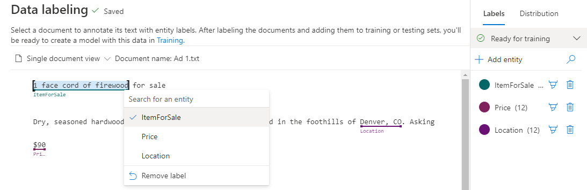
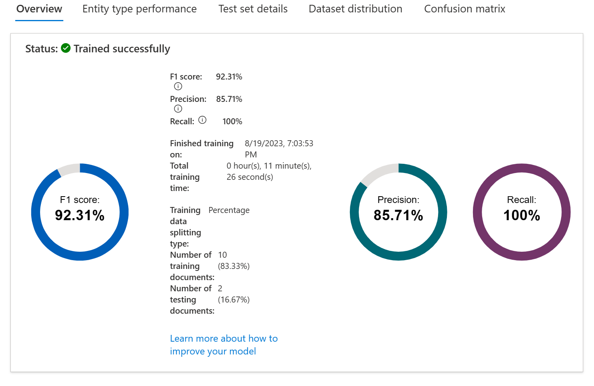
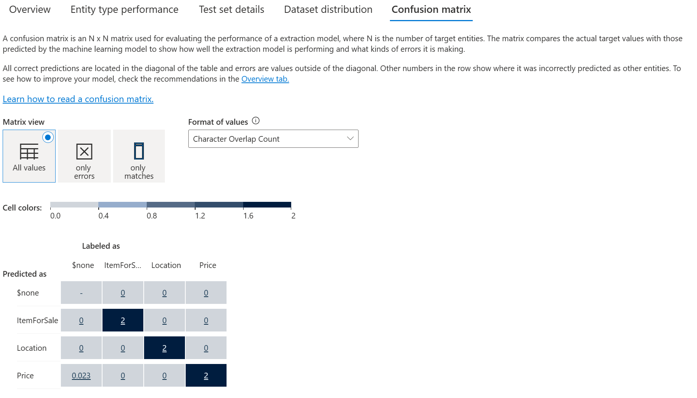

# [Custom named entity recognition](https://learn.microsoft.com/en-us/training/modules/custom-name-entity-recognition/)

Build a custom entity recognition solution to **extract entities from unstructured documents**.

## Learning objectives

After completing this module, you'll be able to:

- Understand tagging entities in extraction projects
- Understand how to **build entity recognition projects**

---

## Introduction

Custom **named entity recognition (NER)**, otherwise known as **custom entity extraction**, is one of the many features for natural language processing (NLP) offered by Azure AI Language service. Custom NER enables developers to **extract predefined entities from text documents**, without those documents being in a known format - such as legal agreements or online ads.

An entity is a **person, place, thing, event, skill, or value**.

In this module, you'll learn how to use the **Azure AI Language service** to extract entities from unstructured documents.

After completing this module, you'll be able to:

- Understand custom named entities and how they're labeled.
- Build **a custom named entity extraction project**.
- Label data, train, and deploy an **entity extraction model**.
- Submit extraction tasks from your own app.

---

## Understand custom named entity recognition

Custom NER is an Azure API service that looks at documents, *identifies, and extracts user defined entities*. These entities could be anything from *names and addresses from bank statements to knowledge mining to improve search results*.

Custom NER is part of Azure AI Language in Azure AI services.

### Custom vs built-in NER

Azure AI Language provides certain built-in entity recognition, to recognize things such as a person, location, organization, or URL. Built-in NER allows you to set up the service with minimal configuration, and extract entities. **To call a built-in NER, create your service and call the endpoint for that NER service** like this:

~~~REST
<YOUR-ENDPOINT>/language/analyze-text/jobs?api-version=<API-VERSION>
~~~

|Placeholder|Value|Example|
| -- | -- | -- |
| `YOUR-ENDPOINT` | The endpoint for your API request | https://<your-resource>.cognitiveservices.azure.com |
| `API-VERSION` | The version of the API you are calling|2023-05-01|

**The body of that call** will contain the document(s) the entities are extracted from, and **the headers** contain your service **key**.

The response from the call above contains an array of entities recognized, such as:

~~~JSON
<...>
"entities":[
    {
        "text":"Seattle",
        "category":"Location",
        "subcategory":"GPE",
        "offset":45,
        "length":7,
        "confidenceScore":0.99
    },
    {
        "text":"next week",
        "category":"DateTime",
        "subcategory":"DateRange",
        "offset":104,
        "length":9,
        "confidenceScore":0.8
    }
]
<...>
~~~

Examples of when to use the **built-in NER** include finding **locations, names, or URLs in long text documents**.

> Tip: A full list of recognized entity categories is available in the [NER docs](https://aka.ms/ner-categories).

**Custom NER**, which is the focus of the rest of this module, is available when the entities you want to extract aren't part of the built-in service or you only want to extract specific entities. You can make your custom NER model as simple or complex as is required for your app.

Examples of when you'd want custom NER include *specific legal or bank data, knowledge mining to enhance catalog search, or looking for specific text for audit policies*. Each one of these projects requires a specific set of entities and data it needs to extract.

### Azure AI Language project life cycle

Creating an entity extraction model typically follows a similar path to most Azure AI Language service features:

- **Define entities**: Understanding the data and entities you want to identify, and try to make them as clear as possible. For example, defining exactly which parts of a bank statement you want to extract.
- **Tag data**: *Label, or tag, your existing data, specifying what text in your dataset corresponds to which entity*. This step is important to do accurately and completely, as any wrong or missed labels will reduce the effectiveness of the trained model. A good variation of possible input documents is useful. For example, label bank name, customer name, customer address, specific loan or account terms, loan or account amount, and account number.
- **Train model**: Train your model once your entities are labeled. Training teaches your model how to recognize the entities you label.
- **View model**: *After your model is trained, view the results of the model*. This page includes **a score of 0 to 1 that is based on the precision and recall of the data tested**. You can see which entities worked well (such as customer name) and which entities need improvement (such as account number).
- **Improve model**: Improve your model by seeing which entities failed to be identified, and which entities were incorrectly extracted. Find out what data needs to be added to your model's training to improve performance. This page shows you how entities failed, and which entities (such as account number) need to be differentiated from other similar entities (such as loan amount).
- **Deploy model**: Once your model performs as desired, deploy your model to make it available via the API. In our example, you can send to requests to the model when it's deployed to extract bank statement entities.
- **Extract entities**: Use your model for extracting entities. The lab covers how to use the API, and you can view the [API reference](https://aka.ms/ct-runtime-swagger) for more details.

### Considerations for data selection and refining entities

For the best performance, you'll need to use both **high quality data** to train the model and **clearly defined entity types**.

High quality data will let you spend less time refining and yield better results from your model.

- **Diversity** - use as diverse of a dataset as possible without losing the real-life distribution expected in the real data. You'll want to **use sample data from as many sources as possible**, each with their own formats and number of entities. It's best to have your dataset represent as many different sources as possible.
- **Distribution** - use the appropriate distribution of document types. A more diverse dataset to train your model will help your model avoid learning incorrect relationships in the data.
- **Accuracy** - **use data that is as close to real world data as possible**. Fake data works to start the training process, but it likely will differ from real data in ways that can cause your model to not extract correctly.

**Entities** *need to also be carefully considered, and defined as distinctly as possible*. Avoid ambiguous entities (such as two names next to each other on a bank statement), as it will make the model struggle to differentiate. If having some ambiguous entities is required, make sure to have more examples for your model to learn from so it can understand the difference.

**Keeping your entities distinct** will also go a long way in helping your model's performance. For example, trying to extract something like "Contact info" that could be a phone number, social media handle, or email address would require several examples to correctly teach your model. Instead, **try to break them down into more specific entities** such as "Phone", "Email", and "Social media" and let the model label whichever type of contact information it finds.

### How to extract entities

To submit an extraction task, the API requires the JSON body to specify which task to execute. For custom NER, the task for the JSON payload is `CustomEntityRecognition`.

Your payload will look similar to the following JSON:

~~~JSON
{
    "displayName": "string",
    "analysisInput": {
        "documents": [
            {
                "id": "doc1", 
                "text": "string"
            },
            {
                "id": "doc2",
                "text": "string"
            }
        ]
    },
    "tasks": [
        {
            "kind": "CustomEntityRecognition",
            "taskName": "MyRecognitionTaskName",
            "parameters": {
            "projectName": "MyProject",
            "deploymentName": "MyDeployment"
            }
        }
    ]
}
~~~

### Project limits

The Azure AI Language service enforces the following restrictions:

- **Training** - at least 10 files, and not more than 100,000
- **Deployments** - 10 deployment names per project
- **APIs**
  - **Authoring** - this API creates a project, trains, and deploys your model. Limited to 10 POST and 100 GET per minute
  - **Analyze** - this API does the work of actually extracting the entities; it requests a task and retrieves the results. Limited to 20 GET or POST
- **Projects** - only 1 storage account per project, 500 projects per resource, and 50 trained models per project
- **Entities** - each entity can be up to 500 characters. You can have up to 200 entity types.

See the [Service limits for Azure AI Language](https://learn.microsoft.com/en-us/azure/ai-services/language-service/concepts/data-limits) page for detailed information.

---

## [Label your data](https://learn.microsoft.com/en-us/training/modules/custom-name-entity-recognition/3-tag-your-data)

**Labeling, or tagging**, your data correctly is an important part of the process to create a custom entity extraction model. Labels identify examples of specific entities in text used to train the model. Three things to focus on are:

- **Consistency** - *Label your data the same way across all files for training*. Consistency allows your model to learn without any conflicting inputs.
- **Precision** - *Label your entities consistently, without unnecessary extra words*. Precision ensures only the correct data is included in your extracted entity.
- **Completeness** - *Label your data completely, and don't miss any entities*. Completeness helps your model always recognize the entities present.

### How to label your data

**Language Studio** is the most straight forward method for labeling your data. Language Studio allows you to *see the file, select the beginning and end of your entity, and specify which entity it is*.

**Each label that you identify gets saved into a file that lives in your storage account with your dataset, in an auto-generated JSON file**. This file then gets used by the model to learn how to extract custom entities. It's possible to provide this file when creating your project (if you're importing the same labels from a different project, for example) however it must be in the [Accepted custom NER data formats.](https://learn.microsoft.com/en-us/azure/ai-services/language-service/custom-named-entity-recognition/concepts/data-formats) For example:

~~~JSON
{
  "projectFileVersion": "{DATE}",
  "stringIndexType": "Utf16CodeUnit",
  "metadata": {
    "projectKind": "CustomEntityRecognition",
    "storageInputContainerName": "{CONTAINER-NAME}",
    "projectName": "{PROJECT-NAME}",
    "multilingual": false,
    "description": "Project-description",
    "language": "en-us",
    "settings": {}
  },
  "assets": {
    "projectKind": "CustomEntityRecognition",
    "entities": [
      {
        "category": "Entity1"
      },
      {
        "category": "Entity2"
      }
    ],
    "documents": [
      {
        "location": "{DOCUMENT-NAME}",
        "language": "{LANGUAGE-CODE}",
        "dataset": "{DATASET}",
        "entities": [
          {
            "regionOffset": 0,
            "regionLength": 500,
            "labels": [
              {
                "category": "Entity1",
                "offset": 25,
                "length": 10
              },
              {
                "category": "Entity2",
                "offset": 120,
                "length": 8
              }
            ]
          }
        ]
      },
      {
        "location": "{DOCUMENT-NAME}",
        "language": "{LANGUAGE-CODE}",
        "dataset": "{DATASET}",
        "entities": [
          {
            "regionOffset": 0,
            "regionLength": 100,
            "labels": [
              {
                "category": "Entity2",
                "offset": 20,
                "length": 5
              }
            ]
          }
        ]
      }
    ]
  }
}
~~~

|Field|Description|
|--|--|
|`documents`|Array of labeled documents|
|`location`|Path to file within container connected to the project|
|`language`|Language of the file|
|`entities`|Array of present entities in the current document|
|`regionOffset`|Inclusive character position for start of text|
|`regionLength`|Length in characters of the data used in training|
|`category`|Name of entity to extract|
|`labels`|Array of labeled entities in the files|
|`offset`|Inclusive character position for start of entity|
|`length`|Length in characters of the entity|
|`dataset`|Which dataset the file is assigned to|

---

## Train and evaluate your model

Training and evaluating your model is *an iterative process of adding data and labels to your training dataset to teach the model more accurately*. To know what types of data and labels need to be improved, Language Studio provides **scoring** in the View model details page on the left hand pane.

Individual entities and your overall model score are broken down into three metrics to explain how they're performing and where they need to improve.

|Metric|Description|
|--|--|
| **Precision** | **The ratio of successful entity recognitions to all attempted recognitions**. A high score means that as long as the entity is recognized, it's labeled correctly. Precision = TP / (TP + FP) |
| **Recall** | **The ratio of successful entity recognitions to the actual number of entities in the document**. A high score means it finds the entity or entities well, regardless of if it assigns them the right label. Recall = TP / (TP + FN) |
| **F1 score** | **Combination of precision and recall** providing a single scoring metric. F1 score = 2 x P x R / (P + R) |

Scores are available both per entity and for the model as a whole. You may find an entity scores well, but the whole model doesn't.

### How to interpret metrics

Ideally we want our model to score well in both precision and recall, which means the entity recognition works well.

**If both metrics have a low score**, it means the model is both struggling to recognize entities in the document, and when it does extract that entity, it doesn't assign it the correct label with high confidence.

**If precision is low but recall is high**, it means that the model recognizes the entity well but doesn't label it as the correct entity type.

**If precision is high but recall is low**, it means that the model doesn't always recognize the entity, but when the model extracts the entity, the correct label is applied.

### Confusion matrix

On the same **View model details** page, there's another tab on the top for the **Confusion matrix**. This view provides a visual table of all the entities and how each performed, giving a complete view of the model and where it's falling short.

The confusion matrix allows you to visually identify where to add data to improve your model's performance.

---

## [Exercise - Extract custom entities](https://learn.microsoft.com/en-us/training/modules/custom-name-entity-recognition/5-exercise-extract-custom-entities)

In this exercise, you use Azure AI Language to build a custom named entity recognition model.

### [Extract custom entities](https://microsoftlearning.github.io/mslearn-ai-language/Instructions/Labs/05-extract-custom-entities.html)

In addition to other natural language processing capabilities, Azure AI Language Service enables you to define custom entities, and extract instances of them from text.

To test the custom entity extraction, we’ll create a model and train it through Azure AI Language Studio, then use a command line application to test it.

---

## Module assessment

1. You've trained your model and you're seeing that it doesn't recognize your entities. What metric score is likely low to indicate that issue? **Recall**
2. You just finished labeling your data. How and where is that file stored to train your model? **JSON file, in my storage account container for the project**.
3. You train your model with only one source of documents, even though real extraction tasks will come from several sources. What data quality metric do you need to increase? **Diversity**

---

## Summary

In this module, you learned about **custom named entity recognition (NER)** and how to extract entities.

In this module, you learned how to:

- Understand custom named entities and how they're labeled.
- Build a Language service project.
- Label data, train, and deploy an entity extraction model.
- Submit extraction tasks from your own app.

To learn more about Azure AI Language, see the [Azure AI Language documentation](https://learn.microsoft.com/en-us/azure/ai-services/language-service/).
