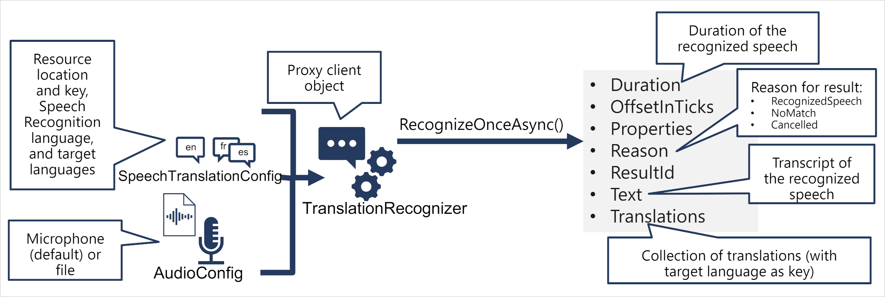

# Translate speech with the Azure AI Speech service

**Translation of speech** builds on speech recognition by recognizing and transcribing spoken input in a specified language, and returning translations of the transcription in one or more other languages.

## Learning objectives

In this module, you will learn how to:

- Provision Azure resources for **speech translation**.
- Generate text translation from speech.
- Synthesize spoken translations.

---

## Introduction

Translation of speech builds on speech recognition by recognizing and transcribing spoken input in a specified language, and returning translations of the transcription in one or more other languages.

In this module, you'll learn how to:

- Provision Azure resources for speech translation.
- Generate text translation from speech.
- Synthesize spoken translations.

The units in the module include important conceptual information about Azure AI Speech and how to use its API through one of the supported software development kits (SDKs), after which you're able to try Azure AI Speech for yourself in a hands-on exercise. To complete the hands-on exercise, you'll need a Microsoft Azure subscription. If you don't already have one, you can sign up for a [free trial](https://azure.com/free).

---

## Provision an Azure resource for speech translation

The Azure AI Speech service provides robust, machine learning and artificial intelligence-based speech translation services, enabling developers to add end-to-end, real-time, speech translations to their applications or services. You can use either **a dedicated Azure AI Speech resource** or **a multi-service Azure AI Services resource**.

Before you can use the service, you need to create an Azure AI Speech resource in your Azure subscription.

After creating your Azure resource, you'll need the following information to use it from a client application through one of the supported SDKs:

- The **location** in which the resource is deployed (for example, eastus)
- **One of the keys** assigned to your resource.

You can view of these values on the **Keys and Endpoint page** for your resource in the Azure portal.

---

## Translate speech to text

The pattern for **speech translation** using the Azure AI Speech SDK is **similar to speech recognition**, with the addition of information about the source and target languages for translation:

- Use a `SpeechTranslationConfig` object to encapsulate the information required to connect to your Azure AI Speech resource. Specifically, its **location and key**.

- The `SpeechTranslationConfig` object is also used to specify the **speech recognition language** (the language in which the input speech is spoken) and the **target languages** into which it should be translated.

- Optionally, use an `AudioConfig` to define the input source for the audio to be transcribed. By default, this is the **default system microphone**, but you can also specify an **audio file**.

- Use the `SpeechTranslationConfig`, and `AudioConfig` to create a `TranslationRecognizer` object. This object is **a proxy client for the Azure AI Speech translation API**.

- Use the methods of the `TranslationRecognizer` object to call the underlying API functions. For example, the `RecognizeOnceAsync()` method uses the Azure AI Speech service to *asynchronously* translate a single spoken utterance.

- Process the response from Azure AI Speech. In the case of the `RecognizeOnceAsync()` method, the result is a `SpeechRecognitionResult` object that includes the following properties:

  - Duration
  - OffsetInTicks
  - Properties
  - Reason
  - ResultId
  - Text
  - Translations

If the operation was successful, the `Reason` property has the enumerated value `RecognizedSpeech`, the Text property contains the transcription in the original language. You can also access a `Translations` property which contains a dictionary of the translations (using the two-character ISO language code, such as "en" for English, as a key).

---

## Synthesize translations

The `TranslationRecognizer` returns *translated transcriptions of spoken input* - essentially *translating audible speech to text*.

You can also synthesize the translation as speech to create **speech-to-speech translation** solutions. There are two ways you can accomplish this.

### Event-based synthesis

When you want to perform **1:1 translation (translating from one source language into a single target language)**, you can use event-based synthesis to capture the translation as an audio stream. To do this, you need to:

Specify the desired voice for the translated speech in the `TranslationConfig`. Create an event handler for the `TranslationRecognizer` object's `Synthesizing` event. In the event handler, use the `GetAudio()` method of the Result parameter to retrieve the byte stream of translated audio. The specific code used to implement an event handler varies depending on the programming language you're using. See the [C#](https://learn.microsoft.com/en-us/azure/ai-services/speech-service/get-started-speech-translation?pivots=programming-language-csharp) and [Python](https://learn.microsoft.com/en-us/azure/ai-services/speech-service/get-started-speech-translation?pivots=programming-language-python) examples in the Speech SDK documentation.

### Manual synthesis

Manual synthesis is an alternative approach to event-based synthesis that doesn't require you to implement an event handler. You can use manual synthesis to generate audio translations for one or more target languages.

**Manual synthesis of translations is essentially just the combination of two separate operations** in which you:

- Use a `TranslationRecognizer` to translate spoken input into text transcriptions in one or more target languages.
- Iterate through the `Translations` dictionary in the result of the translation operation, using a `SpeechSynthesizer` to synthesize an audio stream for each language.

---

## [Exercise - Translate speech](https://learn.microsoft.com/en-us/training/modules/translate-speech-speech-service/5-exercise-translate-speech)

In this exercise, build an app that recognizes and translates speech into a specific language.

### [Translate Speech](https://microsoftlearning.github.io/mslearn-ai-language/Instructions/Labs/08-translate-speech.html)

Azure AI Speech includes a speech translation API that you can use to translate spoken language. For example, suppose you want to develop a translator application that people can use when traveling in places where they don’t speak the local language. They would be able to say phrases such as “Where is the station?” or “I need to find a pharmacy” in their own language, and have it translate them to the local language.

---

## Module assessment

1. Which SDK object should you use to specify the language(s) into which you want speech translated? **SpeechTranslationConfig**
2. Which SDK object should you use as a proxy for the Translation API of Azure AI Speech service? **TranslationRecognizer**
3. When translating speech, in which cases can you use the Synthesizing event to synthesize the translations and speech? **Only when translating to a single target language**.

---

## Summary

Now that you've completed this module, you learned how to:

- Provision Azure resources for speech translation.
- Generate text translation from speech.
- Synthesize spoken translations.

For more information about speech translation, refer to the [Azure AI Speech documentation](https://learn.microsoft.com/en-us/azure/ai-services/speech-service/speech-translation).
