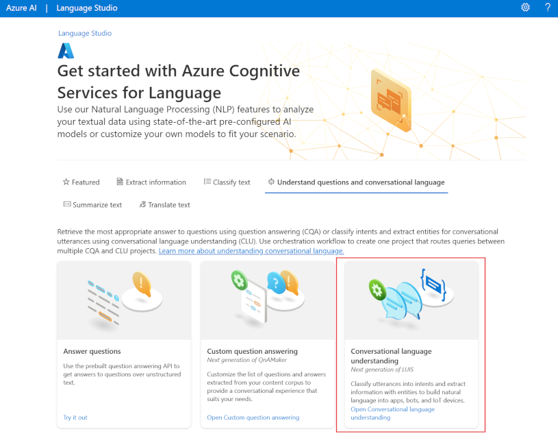

# Build a conversational language understanding model

The Azure AI Language **conversational language understanding service (CLU)** enables you to train a model that apps can use to extract meaning from natural language.

## Learning objectives
After completing this module, you'll be able to:

- Provision Azure resources for Azure AI Language resource
- Define intents, utterances, and entities
- Use patterns to differentiate similar utterances
- Use pre-built entity components
- Train, test, publish, and review an Azure AI Language model

---

## Introduction

[Video](https://share.vidyard.com/watch/XYUdrPj43e5HhMYB6PRFVP?)

**Natural language processing (NLP)** is a common AI problem in which software must be able to work with text or speech in the natural language form that a human user would write or speak. Within the broader area of NLP, **natural language understanding (NLU)** deals with the problem of determining semantic meaning from natural language - usually by using a trained language model.

A common design pattern for a natural language understanding solution looks like this:

In this design pattern:

1. An app accepts natural language input from a user.
2. A language model is used to determine semantic meaning (the user's intent).
3. The app performs an appropriate action.

**Azure AI Language** enables developers to build apps based on language models that can be trained with a relatively small number of samples to discern a user's intended meaning.

In this module, you'll learn how to use the service to create a natural language understanding app using Azure AI Language.

After completing this module, you’ll be able to:

- Provision an Azure AI Language resource.
- Define intents, entities, and utterances.
- Use patterns to differentiate similar utterances.
- Use pre-built entity components.
- Train, test, publish, and review a model.

---

## Understand prebuilt capabilities of the Azure AI Language service

The Azure AI Language service provides various features for understanding human language. You can use each feature to better communicate with users, better understand incoming communication, or use them together to provide more insight into what the user is saying, intending, and asking about.

Azure AI Language service features fall into two categories: **Pre-configured features, and Learned features**. Learned features require building and training a model to correctly predict appropriate labels, which is covered in upcoming units of this module.

This unit covers most of the capabilities of the Azure AI Language service, but head over to the [Azure AI Language service documentation](https://learn.microsoft.com/en-us/azure/cognitive-services/language-service/overview) for a full list, including quickstarts and a full explanation of everything available.

Using these features in your app requires sending your query to the appropriate endpoint. The endpoint used to query a specific feature varies, but all of them are prefixed with the Azure AI Language resource you created in your Azure account, either when building your REST request or defining your client using an SDK. Examples of each can be found in the next unit.

---

## Pre-configured features

The Azure AI Language service provides certain features without any model labeling or training. Once you create your resource, you can send your data and use the returned results within your app.

The following features are all pre-configured.

### Summarization
Summarization is available for both documents and conversations, and will summarize the text into key sentences that are predicted to encapsulate the input's meaning.

### Named entity recognition
Named entity recognition can **extract and identify entities, such as people, places, or companies**, allowing your app to recognize different types of entities for improved natural language responses. For example, given the text "The waterfront pier is my favorite Seattle attraction", Seattle would be identified and categorized as a location.

### Personally identifiable information (PII) detection
PII detection allows you to **identify, categorize, and redact information that could be considered sensitive**, such as email addresses, home addresses, IP addresses, names, and protected health information. For example, if the text "email@contoso.com" was included in the query, the entire email address can be identified and redacted.

### Key phrase extraction
Key phrase extraction is a feature that quickly pulls the main concepts out of the provided text. For example, given the text "Text Analytics is one of the features in Azure AI Services.", the service would extract "Azure AI Services" and "Text Analytics".

### Sentiment analysis
Sentiment analysis identifies how **positive or negative** a string or document is. For example, given the text "Great hotel. Close to plenty of food and attractions we could walk to", the service would identify that as positive with a relatively high confidence score.

### Language detection
Language detection takes one or more documents, and identifies the language for each. For example, if the text of one of the documents was "Bonjour", the service would identify that as French.

---

## Learned features

Learned features require you to label data, train, and deploy your model to make it available to use in your application. These features allow you to customize what information is predicted or extracted.

> Note: Quality of data greatly impacts the model's accuracy. Be intentional about what data is used, how well it is tagged or labeled, and how varied the training data is. For details, see recommendations for labeling data, which includes valuable guidelines for tagging data. Also see the evaluation metrics that can assist in learning where your model needs improvement.

### Conversational language understanding (CLU)
CLU is one of the core custom features offered by Azure AI Language. CLU helps users to build **custom natural language understanding models to predict overall intent and extract important information from incoming utterances**. CLU does require data to be tagged by the user to teach it how to predict intents and entities accurately.

*The exercise in this module will be building a CLU model and using it in your app.*

### Custom named entity recognition
Custom entity recognition takes custom labeled data and extracts specified entities from unstructured text. For example, if you have various contract documents that you want to extract involved parties from, you can train a model to recognize how to predict them.

### Custom text classification
Custom text classification enables users to classify text or documents as custom defined groups. For example, you can train a model to look at news articles and identify the category they should fall into, such as News or Entertainment.

### Question answering
Question answering is a mostly pre-configured feature that provides answers to questions provided as input. The data to answer these questions comes from documents like FAQs or manuals.

For example, say you want to make a virtual chat assistant on your company website to answer common questions. You could use a company FAQ as the input document to create the question and answer pairs. Once deployed, your chat assistant can pass input questions to the service, and get the answers as a result.

For a complete list of capabilities and how to use them, see the [Azure AI Language documentation](https://learn.microsoft.com/en-us/azure/ai-services/language-service/overview).

---

## [Understand resources for building a conversational language understanding model](https://learn.microsoft.com/en-us/training/modules/build-language-understanding-model/2-understand-resources-for-building)

To use the Language Understanding service to develop a NLP solution, you'll need to **create a Language resource in Azure**. That resource will be used for both authoring your model and processing prediction requests from client applications.

> Tip: This module's lab covers building a model for conversational language understanding. For more focused modules on custom text classification and custom named entity recognition, see the custom solution modules in the [Develop natural language solutions](https://learn.microsoft.com/en-us/training/paths/develop-language-solutions-azure-ai) learning path.

### Build your model

For features that require a model for prediction, you'll need to build, train and deploy that model before using it to make a prediction. This building and training will teach the Azure AI Language service what to look for.

First, you'll need to create your Azure AI Language resource in the [Azure portal](https://portal.azure.com/). Then:

1. Search for **Azure AI services**.
2. Find and select **Language Service**.
3. Select *Create* under the **Language Service**.
4. Fill out the necessary details, choosing the region closest to you geographically (for best performance) and giving it a unique name.

Once that resource has been created, you'll need a key and the endpoint. You can find that on the left side under Keys and Endpoint of the resource overview page.

#### Use Language Studio

For a more visual method of building, training, and deploying your model, you can use [Language Studio](https://aka.ms/languageStudio) to achieve each of these steps. On the main page, you can choose to create a Conversational language understanding project. Once the project is created, then go through the same process as above to build, train, and deploy your model.

The lab in this module will walk through using Language Studio to build your model. If you'd like to learn more, see the [Language Studio quickstart](https://learn.microsoft.com/en-us/azure/ai-services/language-service/language-studio).

#### Use the REST API

One way to build your model is through the REST API. The pattern would be to create your project, import data, train, deploy, then use your model.

These tasks are done asynchronously; you'll need to submit a request to the appropriate URI for each step, and then send another request to get the status of that job.

For example, if you want to deploy a model for a conversational language understanding project, you'd submit the deployment job, and then check on the deployment job status.

##### Authentication

For each call to your Azure AI Language resource, you authenticate the request by providing the following header.

| Key | Value | 
| -- | -- |
| Ocp-Apim-Subscription-Key | The key to your resource |

##### Request deployment

Submit a POST request to the following endpoint.

`{ENDPOINT}/language/authoring/analyze-conversations/projects/{PROJECT-NAME}/deployments/{DEPLOYMENT-NAME}?api-version={API-VERSION}`

| Placeholder | Value | Example |
| -- | -- | -- |
| `{ENDPOINT}` | The endpoint of your Azure AI Language resource | `https://<your-subdomain>.cognitiveservices.azure.com` |
| `{PROJECT-NAME}` | The name for your project. This value is case-sensitive | `myProject` |
| `{DEPLOYMENT-NAME}` | The name for your deployment. This value is case-sensitive | `staging` |
| `{API-VERSION}` | The version of the API you're calling | `2022-05-01` |

Include the following `body` with your request.

`{
  "trainedModelLabel": "{MODEL-NAME}",
}`

| Placeholder | Value |
| -- | -- |
| `MODEL-NAME` | The model name that will be assigned to your deployment. This value is case-sensitive. |

Successfully submitting your request will receive a `202` response, with a response header of operation-location. This header will have a URL with which to request the status, formatted like this:

`{ENDPOINT}/language/authoring/analyze-conversations/projects/{PROJECT-NAME}/deployments/{DEPLOYMENT-NAME}/jobs/{JOB-ID}?api-version={API-VERSION}`

#### Get deployment status

Submit a `GET` request to the URL from the response header above. The values will already be filled out based on the initial deployment request.

`{ENDPOINT}/language/authoring/analyze-conversations/projects/{PROJECT-NAME}/deployments/{DEPLOYMENT-NAME}/jobs/{JOB-ID}?api-version={API-VERSION}`

| Placeholder | Value |
| -- | -- |
| `ENDPOINT` | The endpoint for authenticating your API request |
| `PROJECT-NAME` | The name for your project (case-sensitive) |
| `DEPLOYMENT-NAME` | The name for your deployment (case-sensitive) |
| `JOB-ID` | The ID for locating your model's training status, found in the header value detailed above in the deployment request |
| `API-VERSION` | The version of the API you're calling |

The response body will give the deployment `status` details. The `status` field will have the value of *succeeded* when the deployment is complete.

`{
    "jobId":"{JOB-ID}",
    "createdDateTime":"String",
    "lastUpdatedDateTime":"String",
    "expirationDateTime":"String",
    "status":"running"
}`

For a full walkthrough of each step with example requests, see the [conversational understanding quickstart](https://learn.microsoft.com/en-us/azure/ai-services/language-service/conversational-language-understanding/quickstart?pivots=rest-api#create-a-clu-project).

### Query your model

To query your model for a prediction, you can **use SDKs in C# or Python**, or **use the REST API**.

#### Query using SDKs

To query your model using an SDK, you **first need to create your client**. Once you have your client, you **then use it to call the appropriate endpoint**.

`language_client = TextAnalyticsClient(
            endpoint=endpoint, 
            credential=credentials)`
`response = language_client.extract_key_phrases(documents = documents)[0]`

Other language features, such as the conversational language understanding, require the request be built and sent differently.

#### Query using the REST API

To query your model using REST, create a `POST` request to the appropriate URL with the appropriate body specified. For built in features such as language detection or sentiment analysis, you'll query the `analyze-text` **endpoint**.

> Tip: Remember each request needs to be authenticated with your Azure AI Language resource key in the `Ocp-Apim-Subscription-Key` header

`{ENDPOINT}/language/:analyze-text?api-version={API-VERSION}`

| Placeholder | Value |
| `ENDPOINT` | The endpoint for authenticating your API request |
| `API-VERSION` | The version of the API you're calling |

Within the body of that request, you must specify the `kind` parameter, which tells the service what type of language understanding you're requesting.

If you want to detect the language, for example, the JSON body would look something like the following.

`{
    "kind": "LanguageDetection",
    "parameters": {
        "modelVersion": "latest"
    },
    "analysisInput":{
        "documents":[
            {
                "id":"1",
                "text": "This is a document written in English."
            }
        ]
    }
}`

Other language features, such as the conversational language understanding, require the request be routed to a different endpoint. For example, the conversational language understanding request would be sent to the following.

`{ENDPOINT}/language/:analyze-conversations?api-version={API-VERSION}`

| Placeholder | Value |
| -- | -- |
| `ENDPOINT` | The endpoint for authenticating your API request |
| `API-VERSION` | The version of the API you're callings |

`{
  "kind": "Conversation",
  "analysisInput": {
    "conversationItem": {
      "id": "1",
      "participantId": "1",
      "text": "Sample text"
    }
  },
  "parameters": {
    "projectName": "{PROJECT-NAME}",
    "deploymentName": "{DEPLOYMENT-NAME}",
    "stringIndexType": "TextElement_V8"
  }
}`

| Placeholder | Value |
| -- | -- |
| `PROJECT-NAME` | The name of the project where you built your model |
| `DEPLOYMENT-NAME` | The name of your deployment |

#### Sample response

The query response from an SDK will in the object returned, which varies depending on the feature (such as in `response.key_phrases` or `response.Value`). The REST API will return JSON that would be similar to the following.

`{
    "kind": "KeyPhraseExtractionResults",
    "results": {
        "documents": [{
            "id": "1",
            "keyPhrases": ["modern medical office", "Dr. Smith", "great staff"],
            "warnings": []
        }],
        "errors": [],
        "modelVersion": "{VERSION}"
    }
}`

For other models like conversational language understanding, a sample response to your query would be similar to the following.

The SDKs for both Python and C# return JSON that is very similar to the REST response.

For full documentation on features, including examples and how-to guides, see the [Azure AI Language documentation](https://learn.microsoft.com/en-us/azure/ai-services/language-service/) documentation pages.

---

## [Define intents, utterances, and entities](https://learn.microsoft.com/en-us/training/modules/build-language-understanding-model/3-define-intents-utterances-entities)

**Utterances** are the phrases that a user might enter when interacting with an application that uses your language model. An **intent** represents *a task or action the user wants to perform, or more simply the* **meaning of an utterance**. You create a model by defining **intents** and associating them with one or more **utterances**.

For example, consider the following list of intents and associated utterances:

- GetTime:
    - "What time is it?"
    - "What is the time?"
    - "Tell me the time"
- GetWeather:
    - "What is the weather forecast?"
    - "Do I need an umbrella?"
    - "Will it snow?"
- TurnOnDevice
    - "Turn the light on."
    - "Switch on the light."
    - "Turn on the fan"
- None:
    - "Hello"
    - "Goodbye"

In your model, you must define the **intents** that you want your model to understand, so spend some time considering the **domain** your model must support and the kinds of **actions or information** that users might request. In addition to the intents that you define, every model includes a `None` intent that you should use to explicitly identify utterances that a user might submit, but for which there is *no specific action required* (for example, conversational greetings like "hello") or that *fall outside of the scope of the domain for this model*.

After you've identified the intents your model must support, it's important to capture various different example **utterances** for each intent. Collect utterances that you think users will enter; including utterances meaning the same thing but that are constructed in different ways. Keep these guidelines in mind:

- Capture multiple different examples, or alternative ways of saying the same thing
- Vary the length of the utterances from short, to medium, to long
- Vary the location of the noun or subject of the utterance. Place it at the beginning, the end, or somewhere in between
- Use correct grammar and incorrect grammar in different utterances to offer good training data examples
- The precision, consistency and completeness of your labeled data are key factors to determining model performance.
    - Label precisely: Label each entity to its right type always. Only include what you want extracted, avoid unnecessary data in your labels.
    - Label consistently: The same entity should have the same label across all the utterances.
    - Label completely: Label all the instances of the entity in all your utterances.

**Entities** are used to add specific context to intents. For example, you might define a `TurnOnDevice` intent that can be applied to multiple devices, and use entities to define the different devices.

Consider the following utterances, intents, and entities:

| Utterance | Intent | Entities |
| -- | -- | -- |
| What is the time? | GetTime | |
| What time is it in *London*?|GetTime|Location (London) |
| What's the weather forecast for *Paris*?|GetWeather|Location (Paris) |
| Will I need an umbrella *tonight*?|GetWeather|Time (tonight) |
| What's the forecast for *Seattle* *tomorrow*?|GetWeather|Location (Seattle), Time (tomorrow) |
| Turn the *light* on.|TurnOnDevice|Device (light) |
| Switch on the *fan*.|TurnOnDevice|Device (fan) |

You can **split entities into a few different component types**:

- **Learned** entities are **the most flexible kind of entity, and should be used in most cases**. You define a learned component with a suitable name, and then associate words or phrases with it in training utterances. When you train your model, it learns to match the appropriate elements in the utterances with the entity.
- **List** entities are useful when you need an entity with a specific set of possible values - for example, days of the week. You can include synonyms in a list entity definition, so you could define a `DayOfWeek` entity that includes the values "Sunday", "Monday", "Tuesday", and so on; each with synonyms like "Sun", "Mon", "Tue", and so on.
- **Prebuilt** entities are useful for common types such as **numbers, datetimes, and names**. For example, when prebuilt components are added, you will automatically detect values such as "6" or organizations such as "Microsoft". You can see this article for a list of [supported prebuilt entities](https://learn.microsoft.com/en-us/azure/ai-services/language-service/conversational-language-understanding/prebuilt-component-reference).

---

## Use patterns to differentiate similar utterances

In some cases, a model might contain **multiple intents** for which utterances are likely to be similar. You can use the pattern of utterances to disambiguate the intents while minimizing the number of sample utterances.

For example, consider the following utterances:

- "Turn on the kitchen light"
- "Is the kitchen light on?"
- "Turn off the kitchen light"

These utterances are syntactically similar, with only a few differences in words or punctuation. However, they represent three different intents (which could be named `TurnOnDevice`, `GetDeviceStatus`, and `TurnOffDevice`). Additionally, the intents could apply to a wide range of entity values. In addition to "kitchen light", the intent could apply to "living room light", television", or any other device that the model might need to support.

To correctly train your model, provide a handful of examples of each intent that specify the different formats of utterances.

- TurnOnDevice:
    - "Turn on the {DeviceName}"
    - "Switch on the {DeviceName}"
    - "Turn the {DeviceName} on"
- GetDeviceStatus:
    - "Is the {DeviceName} on[?]"
- TurnOffDevice:
    - "Turn the {DeviceName} off"
    - "Switch off the {DeviceName}"
    - "Turn off the {DeviceName}"

When you teach your model with each different type of utterance, the Azure AI Language service can learn how to categorize intents correctly based off format and punctuation.

---

## Use pre-built entity components

You can **create your own language models by defining all the intents and utterances it requires**, but often you can use prebuilt components to detect common entities such as **numbers, emails, URLs, or choices**.

For a full list of prebuilt entities the Azure AI Language service can detect, see the list of [supported prebuilt entity components](https://learn.microsoft.com/en-us/azure/ai-services/language-service/conversational-language-understanding/prebuilt-component-reference).

Using prebuilt components allows you to let the Azure AI Language service automatically detect the specified type of entity, and not have to train your model with examples of that entity.

To add a prebuilt component, you can create an entity in your project, then select **Add new prebuilt** to that entity to detect certain entities.

You can have **up to five prebuilt components per entity**. Using prebuilt model elements can significantly reduce the time it takes to develop a conversational language understanding solution.

---

## Train, test, publish, and review a conversational language understanding model

Creating a model is an iterative process with the following activities:

- **Train a model** to **learn intents and entities from sample utterances**.
- **Test the model interactively** or using a testing dataset with known labels
- **Deploy a trained model** to *a public endpoint* so client apps can use it
- **Review predictions and iterate on utterances** to train your model

By following this iterative approach, you can improve the language model over time based on user input, helping you develop solutions that reflect the way users indicate their intents using natural language.

---

## [Exercise - Build an Azure AI services conversational language understanding model](https://learn.microsoft.com/en-us/training/modules/build-language-understanding-model/7-exercise)

In this exercise, you use Azure AI Language to build a conversational language understanding model.

### [Create a language understanding model with the Language service](https://microsoftlearning.github.io/mslearn-ai-language/Instructions/Labs/03-language-understanding.html)

> NOTE: The conversational language understanding feature of the Azure AI Language service is currently in **preview**, and subject to change. In some cases, model training may fail - if this happens, try again.

The Azure AI Language service enables you to define a **conversational language understanding model** that applications can use to **interpret natural language input from users, predict the users intent (what they want to achieve), and identify any entities to which the intent should be applied**.

For example, a conversational language model for a clock application might be expected to process input such as:

*What is the time in London?*

This kind of input is an example of an utterance (something a user might say or type), for which the desired intent is to get the time in a specific location (an entity); in this case, London.

---

## Module assessment

1. Your app must interpret a command such as "*turn on the light*" or "*switch the light on*". What do these phrases represent in a language model? **Utterances**
2. Your app must interpret a command to book a flight to a specified city, such as "Book a flight to Paris." How should you model the city element of the command? **As an entity**
3. Your language model needs to detect an email when present in an utterance. What is the simplest way to extract that email? **Use prebuilt entity components**

---

## Summary

In this module, you learned how to create a conversational language understanding model.

Now that you've completed this module, you can:

- Provision an Azure AI Language resource
- Define **intents, entities, and utterances**
- Use patterns to differentiate similar utterances
- Use pre-built entity components
- Train, test, publish, and review a model

To learn more about language understanding, see the [Azure AI Language documentation](https://learn.microsoft.com/en-us/azure/ai-services/language-service/).