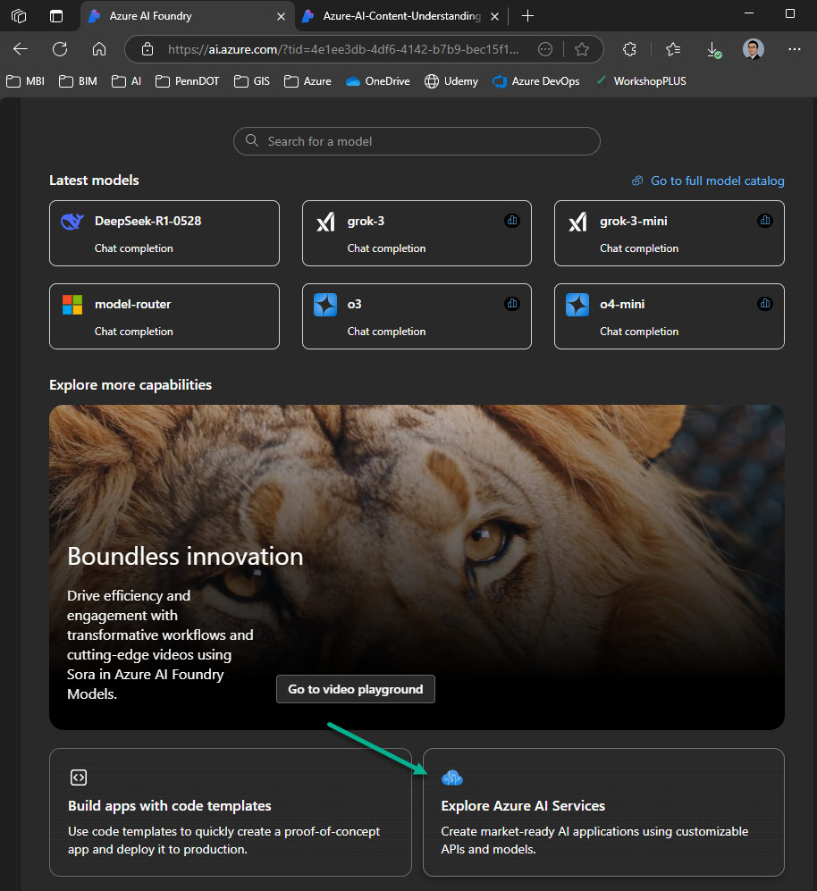
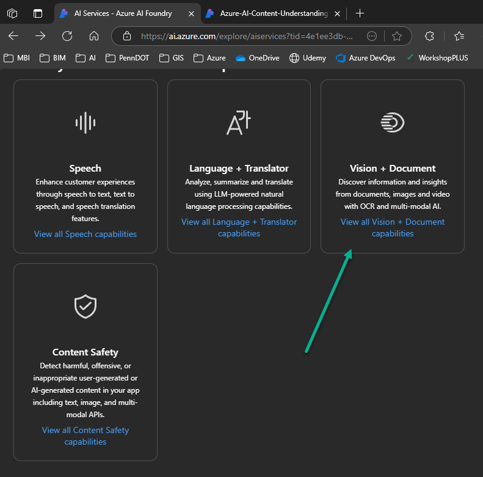
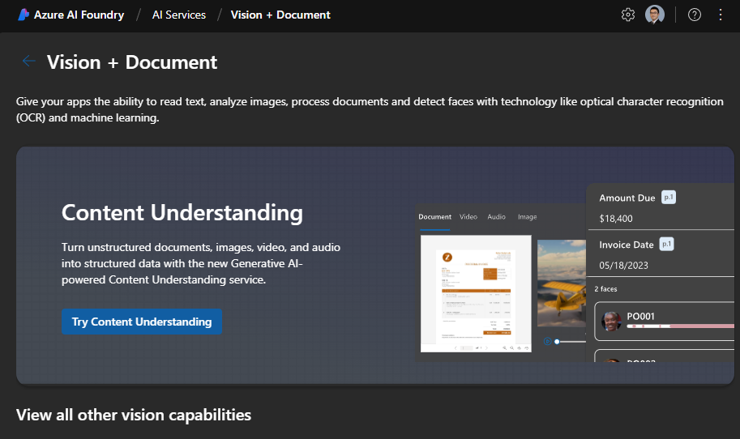

# [Create a multimodal analysis solution with Azure AI Content Understanding](https://learn.microsoft.com/en-us/training/modules/analyze-content-ai/)

Use **Azure AI Content Understanding** for **multimodal content analysis and information extraction**.

## Learning objectives
After completing this module, you will be able to:

- Describe capabilities of Azure AI Content Understanding.
- Use Azure AI Content Understanding to build a **content analyzer**.
- Consume a **Content Understanding analyzer** by using the REST API.

---

## Introduction

Organizations today rely on information that is often locked up in content assets such as documents, images, videos, and audio recordings. Extracting information from this content can be challenging, laborious, and time-consuming, and organizations often need to build solutions based on multiple technologies for content analysis depending on the formats being used.

**Azure AI Content Understanding** is **a multimodal service that simplifies the creation of AI-powered analyzers that can extract information from content** in practically any format.

In this module, you'll explore the capabilities of Azure AI Content Understanding, and learn how to use it to build custom analyzers.

> Note: Azure AI Content Understanding is currently in public preview. Details described in this module are subject to change.

---

## What is Azure AI Content Understanding?

**Azure AI Content Understanding** is *a generative AI service that you can use to extract insights and data from multiple kinds of content*. With Content Understanding, you can quickly build applications that analyze complex data and generate outputs that can be used to automate and optimize processes.

**Content Understanding** is a component of Azure AI services. To use it, you need to provision an Azure AI services resource in your Azure subscription. You can develop and manage a Content Understanding solution:

- In the **Azure AI Foundry portal**
- By using the **Content Understanding REST API**

### Multimodal content analysis

Content Understanding can extract information from common kinds of content, enabling you to use a single service with a straightforward and consistent development process to **build multimodal content analysis solutions**.

#### Documents and forms

You can use Content Understanding to **analyze documents and forms and retrieve specific field values**. For example, you could extract key data values from an invoice to automate payment processing.

#### Images

You can analyze images to *infer information from visuals such as charts, identify physical defects in products or other items, detect the presence of specific objects or people, or determine other information visually*.

#### Audio

Analysis of audio enables you to automate tasks like *summarizing conference calls, determining sentiment of recorded customer conversations, or extracting key data from telephone messages*.

#### Video

Video accounts for a large volume of the data captured today, and you can use Content Understanding to **analyze and extract insights from video** to support many scenarios. For example, to *extract key points from video conference recordings, to summarize presentations, or to detect the presence of specific activity in security footage*.

---

## [Create a Content Understanding analyzer](https://learn.microsoft.com/en-us/training/modules/analyze-content-ai/03-create-analyzer)

**Content Understanding** solutions are based on the creation of an **analyzer**; which is trained to extract specific information from a particular type of content based on a schema that you define.

The high-level process for creating a Content Understanding solution includes the following steps:

1. Create an *Azure AI services resource*.
2. **Define a Content Understanding schema** for the information to be extracted. This can be based on **a content sample** and **an analyzer template**.
3. **Build an analyzer** based on the completed schema.
4. Use the **analyzer** to extract or generate fields from new content.

Numerous **analyzer templates** are provided to help you develop an appropriate analyzer for your needs quickly. Additionally, because of the generative AI capabilities of Content Understanding, you can use minimal training data to define a schema by example. In many cases, the service accurately identifies the data values in the sample content that map to the schema elements automatically, though you can also explicitly label fields in content such as documents to improve the performance of your analyzer.

### Creating an analyzer with Azure AI Foundry

While you can provision an Azure AI services resource and develop a complete Content Understanding solution through the REST API, **the preferred approach for AI development projects is to use zure AI Foundry**. Specifically, you can **use the Azure AI Foundry portal to create a project, define a Content Understanding schema, and build and test an analyzer**.

#### 1. Creating a Content Understanding project

In Azure AI Foundry, you can *create a project* in an existing AI hub, or you can create a new hub as you create the project. In addition to the AI hub itself, creating a hub provisions the Azure resources needed to support one or more projects; including an Azure AI services resource, storage, and a key vault resource to store sensitive details like credentials and keys.

> Note: Content Understanding schemas can only be created in Azure locations where the service is supported. For more information, see [Content Understanding region and language support](https://learn.microsoft.com/en-us/azure/ai-services/content-understanding/language-region-support).

#### 2. Defining a schema

After creating a project, **the first step in building an analyzer is to define a schema** for the content the analyzer will process, and the information it will extract. **Azure AI Foundry provides a schema editor interface** in which you can upload a file (document, image, audio, or video) on which the schema should be based. You can then apply an appropriate schema template and define the specific fields you want the analyzer to identify.

> Note: The templates and field types available in a schema depend on the content type of the file on which the schema is based. Some content types support additional optional functionality, such as extracting barcodes and formulae from text in documents. For more information about using Content Understanding with different content types, see the following articles in the product documentation:
> - [Content Understanding document solutions](https://learn.microsoft.com/en-us/azure/ai-services/content-understanding/document/overview)
> - [Content Understanding image solutions](https://learn.microsoft.com/en-us/azure/ai-services/content-understanding/image/overview)
> - [Content Understanding audio solutions](https://learn.microsoft.com/en-us/azure/ai-services/content-understanding/audio/overview)
> - [Content Understanding video solutions](https://learn.microsoft.com/en-us/azure/ai-services/content-understanding/video/overview)

#### 3. Testing

You can **test the analyzer schema** at any time during the development process by running analysis on the sample file used to define the schema or other uploaded files. **The test results include the extracted field values and the JSON format output** returned by the analyzer to client applications.

#### 4. Building an analyzer

When you're satisfied with the performance of your schema, you can build your analyzer. Building an analyzer makes it **accessible to client applications through Content Understanding endpoint** for the Azure AI services resource associated with your project.

After building your analyzer, you can continue to test it in the Azure AI Foundry portal, and refine the schema to create new named versions with different capabilities.

---

## Use the Content Understanding REST API

The **Content Understanding REST API** provides a programmatic interface that you can use to **create, manage, and consume analyzers**.

To use the REST API, your *client application submits HTTP calls to the Content Understanding* **endpoint** for your Azure AI services resource, **passing one of the *authorization keys* in the header**. You can obtain the endpoint and keys in the Azure portal or in the Azure AI Foundry portal. You can also use the Azure AI Foundry API to connect to the project and retrieve the endpoint and key for your Azure AI Services resource programmatically.

### Using the REST API to analyze content

**One of the most common uses of the REST API is to submit content to an existing analyzer that you have previously built, and retrieve the results of analysis**. The **analysis request returns an operation ID** value that represents an asynchronous task. Your client application must then use another request to **pass the operation ID back to the endpoint and retrieve the operation status** - potentially polling multiple times until the operation is complete and **the results are returned in JSON format**.

For example, to analyze a document, a client application might submit a POST request to the analyze function containing the following JSON body:

`POST {endpoint}/contentunderstanding/analyzers/{analyzer}:analyze?api-version={api version}
{
  "url": "https://host.com/doc.pdf"
}`

> Note: You can **specify a URL for the content file location**, or you can **include the binary contents of the file**.

Assuming the request is authenticated and initiated successfully, the response will be similar to this example:

`Operation-Id: 1234abcd-1234-abcd-1234-abcd1234abcd`
`Operation-Location: {endpoint}/contentunderstanding/analyzers/{analyzer}/results/1234abcd-1234-abcd-1234-abcd1234abcd?api-version={api version}
{
  "id": "1234abcd-1234-abcd-1234-abcd1234abcd",
  "status": "NotStarted"
}`

Your client application must then use the **operation ID** that has been returned to **check the status of the operation until it has succeeded (or failed)** by submitting a GET request to the results function.

`GET {endpoint}/contentunderstanding/analyzers/{analyzer}/results/1234abcd-1234-abcd-1234-abcd1234abcd?api-version={api version}`

When the operation has completed successfully, **the response contains a JSON payload representing the results of the analysis**. The specific results depend on the content and schema.

> Note: For more information about the Content Understanding REST API, see the [reference documentation](https://learn.microsoft.com/en-us/rest/api/contentunderstanding/operation-groups).

---

## [Exercise - Extract information from multimodal content](https://learn.microsoft.com/en-us/training/modules/analyze-content-ai/05-exercise)

### [Extract information from multimodal content](https://microsoftlearning.github.io/mslearn-ai-information-extraction/Instructions/Labs/01-content-understanding.html)

In this exercise, you use Azure Content Understanding to extract information from a variety of content types; including an invoice, an images of a slide containing charts, an audio recording of a voice messages, and a video recording of a conference call.

---

## Module assessment

1. What kinds of AI solution is Azure AI Content Understanding designed to help you build? **Analyzers that extract information from documents, images, videos, and audio files**.
2. Which graphical tool should you use to create an Azure AI Content Understanding project? **Azure AI Foundry protal**.
3. What should you define for the information you want to extract from content? **A schema**

---

## Summary

**Azure AI Content Understanding is a multimodal AI service that enables you to extract information from many different kinds of content**. 

In this module, you learned how to use the **Azure AI Foundry portal** to create a Content Understanding project and build an **analyzer**.

> Note: For more information about Azure AI Content Understanding, see [Azure AI Content Understanding documentation](https://learn.microsoft.com/en-us/azure/ai-services/content-understanding/).