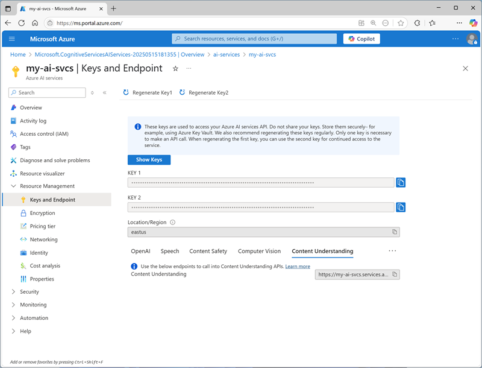
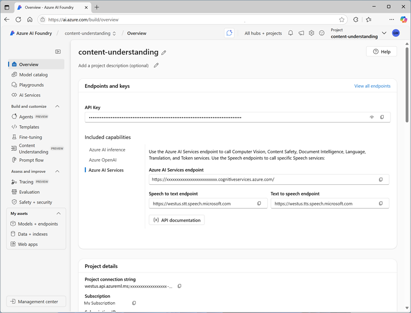
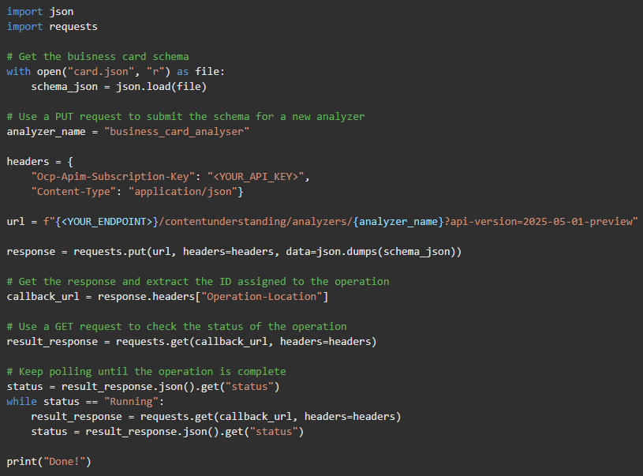
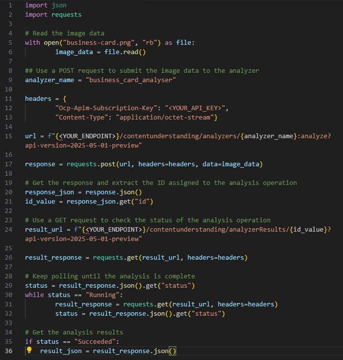
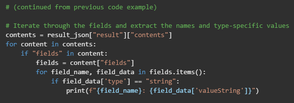

# [Create an Azure AI Content Understanding client application](https://learn.microsoft.com/en-us/training/modules/analyze-content-ai-api/)

Use the **Azure AI Content Understanding *REST API*** for **multimodal content analysis and information extraction**.

## Learning objectives

After completing this module, you will be able to:

- Use the Azure AI Content Understanding REST API to **build a content analyzer**.
- Use the Azure AI Content Understanding REST API to **consume a content analyzer**.

---

## Introduction

**Azure AI Content Understanding is a multimodal service that simplifies the creation of AI-powered analyzers that can extract information from multiple content formats**, including *documents, images, audio files, and videos*.

> Tip: To learn how to build Azure AI Content Understanding analyzers, complete the [Create a multimodal analysis solution with Azure AI Content Understanding](https://learn.microsoft.com/en-us/training/modules/analyze-content-ai/) module.

You can develop client applications that use **Azure AI Content Understanding analyzers** by using the **Azure AI Content Understanding REST API**; which is the focus of this module.

In this module, you'll learn how to write code that **uses the REST API to submit a content file to an analyzer and process the results**.

> Note: Azure AI Content Understanding is currently in public preview. Details described in this module are subject to change.

---

## [Prepare to use the AI Content Understanding REST API](https://learn.microsoft.com/en-us/training/modules/analyze-content-ai-api/02-prepare-content-understanding)

Before you can use the **Azure AI Content Understanding REST API**, you need an **Azure AI services multi-services resource** in your Azure subscription. You can provision this resource in the following ways:

- Create an **Azure AI services** resource in the Azure portal.
- Create an **Azure AI Foundry** hub, which includes an Azure AI services resource by default.

> Tip: Creating an Azure AI Foundry hub enables you to work in an Azure AI Foundry project, in which you can use visual tools to create and manage Azure AI Content Understanding schemas and analyzers.

After you've provisioned an Azure AI services resource, you need the following information to connect to the **Azure AI Content Understanding REST API** from a client application:

- The Azure AI services resource **endpoint**
- One of the **API keys** associated with the endpoint.

You can obtain these values from the Azure portal, as shown in the following image:

If you're working within an Azure AI Foundry project, you can find the **endpoint** and **key** for the associated *Azure AI services resource* in the *Azure AI Foundry portal*, as shown in the following image:

When working in an Azure AI Foundry project, you can also write code that uses the **Azure AI Foundry SDK** to connect to the project using **Microsoft Entra ID authentication**, and retrieve the connection details for the Azure AI services resource; including the endpoint and key.

> Tip: To learn more about programming with the Azure AI Foundry SDK, complete the [Develop an AI app with the Azure AI Foundry SDK](https://learn.microsoft.com/en-us/training/modules/ai-foundry-sdk/) module.

---

## [Create a Content Understanding analyzer](https://learn.microsoft.com/en-us/training/modules/analyze-content-ai-api/03-create-analyzer)

In most scenarios, you should consider creating and testing analyzers using the **visual interface in the Azure AI Foundry portal**. However, in some cases you might want to create an analyzer by submitting **a JSON definition of the schema** for your desired content fields to the **REST API**.

### Defining a schema for an analyzer

Analyzers are based on **schemas that define the fields you want to extract or generate from a content file**. At its simplest, a schema is a set of fields, which can be specified in a JSON document, as shown in this example of an analyzer definition:

`{
    "description": "Simple business card",
    "baseAnalyzerId": "prebuilt-documentAnalyzer",
    "config": {
        "returnDetails": true
    },
    "fieldSchema": {
        "fields": {
            "ContactName": {
                "type": "string",
                "method": "extract",
                "description": "Name on business card"
            },
            "EmailAddress": {
                "type": "string",
                "method": "extract",
                "description": "Email address on business card"
            }
        }
    }
}`

This example of a custom analyzer schema is based on the **pre-built document analyzer**, and describes *two fields* that you would expect to find on a business card: *ContactName* and *EmailAddress*. Both fields are defined as string data types, and are expected to be extracted from a document (in other words, the string values are expected to exist in the document so they can be "read"; rather than being fields that can be generated by inferring information about the document).

> Note: This example is deliberately simple, with the minimal information needed to create a working analyzer. In reality, the schema would likely include more fields of different types, and the analyzer definition would include more configuration settings. The JSON might even include a sample document. See the [Azure AI Content Understanding REST API documentation](https://learn.microsoft.com/en-us/rest/api/contentunderstanding/content-analyzers/create-or-replace) for more details.

### Using the REST API to create an analyzer

With your analyzer definition in place, you can use the REST API to submit it to Azure AI Content Understanding to be created. The JSON data is submitted as a `PUT` request to the **endpoint** with the **API key** *in the request header* to start the analyzer creation operation.

The response from the `PUT` request includes a Operation-Location in the header, which provides a **callback URL** that you can use to **check on the status of the request** by submitting a `GET` request.

You can use any HTTP-capable client tool or language to submit the request. For example, the following Python code submits a request to create an analyzer based on the contents of a file named `card.json` (which is assumed to contain the JSON definition described previously)

---

## Analyze content

To analyze the contents of a file, you can use the **Azure AI Content Understanding REST API** to submit it to the **endpoint** using a `POST` request. You can specify the **content as a URL** (for a file hosted in an Internet-accessible location) or as the **binary contents of the file** (for example, a .pdf document, a .png image, an .mp3 audio file, or an .mp4 video file). The request header must include the **API key**, and the **endpoint** address for the analyze request includes the analyzer to be used.

As with the request to create an analyzer, the analyze request starts an **asynchronous** operation. The `POST` request returns a unique operation ID, which you can then use in a `GET` request to **check the status of the analysis operation**.

For example, suppose you want to use the *business card analyzer* discussed previously to extract the name and email address from the following scanned business card image:

The following Python code submits a request for analysis, and then polls the service until the operation is complete and the results are returned.

### Processing analysis results

The results in the response JSON depend on:

- The **kind of content** the *analyzer* is designed to analyze (for example, document, video, image, or audio).
- The **schema** for the analyzer.
- The **contents of the file** that was analyzed.

For example, the response from the document-based business card analyzer when analyzing the business card described previously contain:

- The extracted fields
- The *optical character recognition (OCR)* layout of the document, including locations of lines of text, individual words, and paragraphs on each page.

Here's the complete JSON response for the business card analysis:

- Confidence score
- Span
- Content
- Source

Your application must typically parse the JSON to retrieve field values. For example, the following python code extracts all of the string values:

The output from this code is shown here:

`ContactName: John Smith`
`EmailAddress: john@contoso.com`

---

## [Exercise - Develop a Content Understanding client application](https://learn.microsoft.com/en-us/training/modules/analyze-content-ai-api/05-exercise)

Now it's your turn to build your own Content Understanding client application!

In this exercise, you use the Azure AI Content Understanding REST API to extract information from content by submitting a file to an analyzer.

### [Develop a Content Understanding client application](https://microsoftlearning.github.io/mslearn-ai-information-extraction/Instructions/Labs/02-content-understanding-api.html)

In this exercise, you use Azure AI Content Understanding to create an analyzer that extracts information from business cards. You’ll then develop a client application that uses the analyzer to extract contact details from scanned business cards.

---

## Module assessment

1. What configuration values are needed to use the Azure AI Content Understanding REST API? **The endpoint and key for the Azure AI service**.
2. What must be specified when calling the analyze method to extract fields from content? **The name of the analyzer**.
3. How are the extracted fields returned? **As type-specific values**.

---

## Summary

**Azure AI Content Understanding** is a **multimodal AI service** that enables you to **extract information from many different kinds of content**. The REST API for the service enables you to create client applications that analyze content to extract and generate field values.

> Note: For more information about Azure AI Content Understanding, see [Azure AI Content Understanding documentation](https://learn.microsoft.com/en-us/azure/ai-services/content-understanding/).
