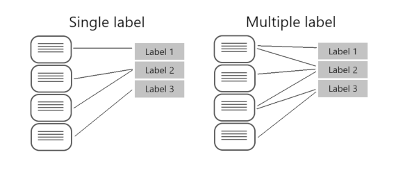
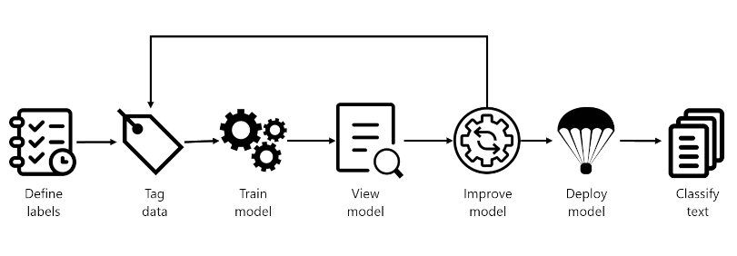

# [Create a custom text classification solution](https://learn.microsoft.com/en-us/training/modules/custom-text-classification/)

The Azure AI Language service enables processing of natural language to use in your own app. Learn how to build a **custom text classification** project.

## Learning objectives

After completing this module, you'll be able to:

- Understand **types of classification projects**
- Build a custom text classification project
- Tag data, train, and deploy a model
- Submit classification tasks from your own app

---

## Introduction

Natural language processing (NLP) is one of the most common AI problems, where software must **interpret text or speech in the natural form that humans use**. Part of NLP is the ability to classify text, and Azure provides ways to **classify text including sentiment, language, and custom categories defined by the user**.

In this module, you'll learn how to use the Azure AI Language service to classify text into custom groups.

---

## Understand types of classification projects 

**Custom text classification assigns labels**, which in the Azure AI Language service is a class that the developer defines, **to text files**. For example, a video game summary might be classified as "Adventure", "Strategy", "Action" or "Sports".

Custom text classification falls into two types of projects:

- **Single label classification** - you can assign only one class to each file. Following the above example, a video game summary could only be classified as "Adventure" or "Strategy".
- **Multiple label classification** - you can assign multiple classes to each file. This type of project would allow you to classify a video game summary as "Adventure" or "Adventure and Strategy".

When creating your custom text classification project, you can specify which project you want to build.

### Single vs. multiple label projects

Beyond the ability to put files into multiple classifications, **the key differences with multiple label classification projects are 1) labeling, 2) considerations for improving your model, and 3) the API payload for classification tasks**.

#### Labeling data

In single label projects, each file is assigned one class during the labeling process; class assignment in Azure AI Language only allows you to select one class.

When labeling multiple label projects, you can assign as many classes that you want per file. The impact of the added complexity means your data has to remain clear and provide a good distribution of possible inputs for your model to learn from.

**Labeling data correctly, especially for multiple label projects, is directly correlated with how well your model performs**. The higher the quality, clarity, and variation of your data set is, the more accurate your model will be.

#### Evaluating and improving your model

Measuring predictive performance of your model goes beyond how many predictions were correct. **Correct classifications are when the actual label is x and the model predicts a label x**. In the real world, documents result in different kinds of errors when a classification isn't correct:

- **False positive** - model predicts x, but the file isn't labeled x.
- **False negative** - model doesn't predict label x, but the file in fact is labeled x.

These metrics are translated into three measures provided by Azure AI Language:

- **Recall** - Of all the actual labels, how many were identified; **the ratio of true positives to all that was labeled**.
- **Precision** - How many of the predicted labels are correct; **the ratio of true positives to all identified positives**.
- **F1 Score** - A function of recall and precision, intended to provide a single score to maximize for a balance of each component

> Tip: Learn more about the [Azure AI Language evaluation metrics](https://aka.ms/language-evaluation-metrics), including exactly how these metrics are calculated.

With a single label project, you can identify which classes aren't classified as well as others and find more quality data to use in training your model. For multiple label projects, figuring out quality data becomes more complex due to the matrix of possible permutations of combined labels.

For example, let's your model is correctly classifying "Action" games and some "Action and Strategy" games, but failing at "Strategy" games. To improve your model, you'll want to find more high quality and varied summaries for both "Action and Strategy" games, as well as "Strategy" games to teach your model how to differentiate the two. This challenge increases exponentially with more possible classes your model is classifying into.

#### API payload

Azure AI Language provides a REST API to build and interact with your model, using a JSON body to specify the request. This API is abstracted into multiple language-specific SDKs, however for this module we'll focus our examples on the base REST API.

To submit a classification task, the API requires the JSON body to specify which task to execute. You'll learn more about the REST API in the next unit, but worth familiarizing yourself with parts of the required body.

Single label classification models specify a project type of `customSingleLabelClassification`

`"projectKind": "customSingleLabelClassification",`

Multiple label classification models specify a project type of `CustomMultiLabelClassification`

`"projectKind": "customMultiLabelClassification",`

---

## Understand how to build text classification projects

Custom text classification projects are your workspace to build, train, improve, and deploy your classification model. You can work with your project in two ways: **through Language Studio and via the REST API**. Language Studio is the GUI that will be used in the lab, but the REST API has the same functionality. Regardless of which method you prefer, the steps for developing your model are the same.

### Azure AI Language project life cycle

- **Define labels**: Understanding the data you want to classify, identify the possible labels you want to categorize into. In our video game example, our labels would be "Action", "Adventure", "Strategy", and so on.
- **Tag data**: Tag, or label, your existing data, specifying the label or labels each file falls under. Labeling data is important since it's how your model will learn how to classify future files. Best practice is to have clear differences between labels to avoid ambiguity, and provide good examples of each label for the model to learn from. For example, we'd label the game "Quest for the Mine Brush" as "Adventure", and "Flight Trainer" as "Action".
- **Train model**: Train your model with the labeled data. Training will teach our model what types of video game summaries should be labeled which genre.
- **View model**: After your model is trained, view the results of the model. **Your model is scored between 0 and 1, based on the precision and recall of the data tested**. Take note of which genre didn't perform well.
- **Improve model**: Improve your model by seeing which classifications failed to evaluate to the right label, see your label distribution, and find out what data to add to improve performance. For example, you might find your model mixes up "Adventure" and "Strategy" games. Try to find more examples of each label to add to your dataset for retraining your model.
- **Deploy model**: Once your model performs as desired, deploy your model to make it available via the API. Your model might be named "GameGenres", and once deployed can be used to classify game summaries.
- **Classify text**: Use your model for classifying text. The lab covers how to use the API, and you can view the [API reference](https://aka.ms/ct-runtime-swagger)

### How to split datasets for training

When labeling your data, you can specify which dataset you want each file to be:

- **Training** - The training dataset is used to actually train the model; the data and labels provided are fed into the machine learning algorithm to teach your model what data should be classified to which label. The training dataset will be the larger of the two datasets, recommended to be about **80% of your labeled data**.
- **Testing** - The testing dataset is labeled data used to verify you model after it's trained. Azure will take the data in the testing dataset, submit it to the model, and compare the output to how you labeled your data to determine how well the model performed. The result of that comparison is how your model gets scored and helps you know how to improve your predictive performance.

During the **Train model** step, there are two options for how to train your model.

- **Automatic split** - Azure takes all of your data, splits it into the specified percentages randomly, and applies them in training the model. **This option is best when you have a larger dataset, data is naturally more consistent, or the distribution of your data extensively covers your classes**.
- **Manual split** - Manually specify which files should be in each dataset. When you submit the training job, the Azure AI Language service will tell you the split of the dataset and the distribution. **This split is best used with smaller datasets to ensure the correct distribution of classes and variation in data are present to correctly train your model**.

To use the automatic split, put all files into the training dataset when labeling your data (this option is the default). To use the manual split, specify which files should be in testing versus training during the labeling of your data.

### Deployment options

Azure AI Language allows each project to create both **multiple models** and **multiple deployments**, each with their own unique name. Benefits include ability to:

- Test two models side by side
- Compare how the split of datasets impact performance
- Deploy multiple versions of your model

> Note: Each project has a limit of ten deployment names

During deployment you can choose the name for the deployed model, which can then be selected when submitting a classification task:

`<...>
  "tasks": [
    {
      "kind": "CustomSingleLabelClassification",
      "taskName": "MyTaskName",
      "parameters": {
        "projectName": "MyProject",
        "deploymentName": "MyDeployment"
      }
    }
  ]
<...>`

### Using the REST API

The REST API available for the Azure AI Language service allows for CLI development of Azure AI Language projects in the same way that Language Studio provides a user interface for building projects. Language Studio is explored further in this module's lab.

#### Pattern of using the API

The API for the Azure AI Language service operates **asynchronously** for most calls. In each step we **submit a request to the service first**, then **check back with the service via a subsequent call to get the status or result**.

With each request, a header is required to authenticate your request:

|Key|Value|
|--|--|
|`Ocp-Apim-Subscription-Key`|The key to your Azure AI Language resource|

#### Submit initial request

The URL to submit the request to varies on which step you are on, but all are prefixed with the `endpoint` provided by your Azure AI Language resource.

For example, to train a model, you would create a POST to the URL that would look something like the following:

`<YOUR-ENDPOINT>/language/analyze-text/projects/<PROJECT-NAME>/:train?api-version=<API-VERSION>`

| Placeholder|Value|Example|
|--|--|--|
|`YOUR-ENDPOINT`|The endpoint for your API request|`https://<your-custom-resource>.cognitiveservices.azure.com`|
|`PROJECT-NAME`|The name for your project (value is case-sensitive)|`myProject`|

The following body would be attached to the request:

`{
    "modelLabel": "<MODEL-NAME>",
    "trainingConfigVersion": "<CONFIG-VERSION>",
    "evaluationOptions": {
        "kind": "percentage",
        "trainingSplitPercentage": 80,
        "testingSplitPercentage": 20
    }
}`

