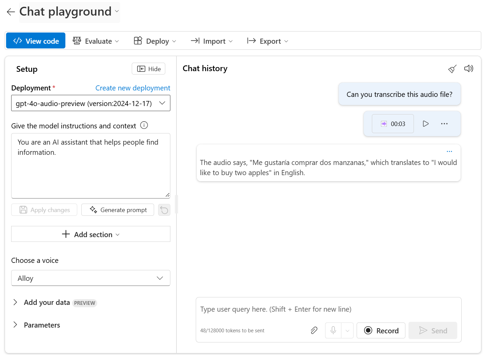

# [Develop an audio-enabled generative AI application](https://learn.microsoft.com/en-us/training/modules/develop-generative-ai-audio-apps/)

A voice carries meaning beyond words, and audio-enabled generative AI models can interpret spoken input to **understand tone, intent, and language**. Learn how to build **audio-enabled chat apps** that listen and respond to audio.

## Learning objectives

After completing this module, you'll be able to:

- Deploy an audio-enabled generative AI model in Azure AI Foundry.
- Create a chat app that submits audio-based prompts.

---

## Introduction

Generative AI models make it possible to build intelligent chat-based applications that can understand and reason over input. Traditionally, text input is the primary mode of interaction with AI models, but multimodal models are increasingly becoming available. These models make it possible for chat applications to respond to audio input as well as text.

In this module, we'll discuss **audio-enabled generative AI** and explore how you can use Azure AI Foundry to create generative AI solutions that respond to prompts that include a mix of text and audio data.

---

## Deploy a multimodal model

To handle prompts that include audio, you need to deploy a **multimodal generative AI model** - in other words, a model that supports not only *text-based input*, but *audio-based input* as well. Multimodal models available in Azure AI Foundry include (among others):

- Microsoft Phi-4-multimodal-instruct
- OpenAI gpt-4o
- OpenAI gpt-4o-mini

> Tip: To learn more about available models in Azure AI Foundry, see the [Model catalog and collections in Azure AI Foundry portal](https://learn.microsoft.com/en-us/azure/ai-foundry/how-to/model-catalog-overview) article in the Azure AI Foundry documentation.

### Testing multimodal models with audio-based prompts

After deploying a multimodal model, you can test it in the chat playground in Azure AI Foundry portal. Some models allow you to include audio attachments in the playground, either by **uploading a file or recording a message**.

In the chat playground, you can upload a local audio file and add text to the message to elicit a response from a multimodal model.

---

## Develop an audio-based chat app

To develop a client app that engages in audio-based chats with a multimodal model, you can use the same basic techniques used for text-based chats. You require a connection to the **endpoint** where the model is deployed, and you use that endpoint to submit prompts that consists of messages to the model and process the responses.

The key difference is that **prompts for an audio-based chat** include multi-part user messages that contain **both a text content item and an audio content item**.

The JSON representation of a prompt that includes a multi-part user message looks something like this:

The audio content item can be:

- A URL to an audio file in a web site.
- Binary audio data

When using binary data to submit a local audio file, the `audio_url` content takes the form of a base64 encoded value in a data URL format:

`{
    "type": "audio_url",
    "audio_url": {
       "url": "data:audio/mp3;base64,<binary_audio_data>"
    }
}`

Depending on the model type, and where you deployed it, you can **use Microsoft Azure AI Model Inference or OpenAI APIs to submit audio-based prompts**. These libraries also provide language-specific SDKs that abstract the underlying REST APIs.

In the exercise that follows in this module, you can *use the Python or .NET SDK for the Azure AI Model Inference API and the OpenAI API to develop an audio-enabled chat application*.

---

## [Exercise - Develop an audio-enabled chat app](https://learn.microsoft.com/en-us/training/modules/develop-generative-ai-audio-apps/4-exercise)

If you have an Azure subscription, you can complete this exercise to develop an audio-enabled chat app.

### [Develop an audio-enabled chat app](https://microsoftlearning.github.io/mslearn-ai-language/Instructions/Labs/09-audio-chat.html)

In this exercise, you use the `Phi-4-multimodal-instruct` generative AI model to generate responses to prompts that include audio files. You’ll develop an app that provides AI assistance for a produce supplier company by using Azure AI Foundry and the Azure AI Model Inference service to summarize voice messages left by customers.

---

## Module assessment

1. Which kind of model can you use to respond to audio input? **Multimodal models**.
2. How can you submit a prompt that asks a model to analyze an audio file? **Submit a prompt that contains a multi-part user message, containing both text content and audio content**.
3. How can you include an audio in a message? **As a URL or as binary data.**

---

## Summary

In this module, you learned about **audio-enabled generative AI models** and how to implement chat solutions that include audio-based input.

Audio-enabled models let you create AI solutions that can understand audio and respond to related questions or instructions. Beyond just identifying spoken words, some models can also use reasoning based on what they hear. For instance, they can summarize a message or assess the speaker's sentiment.

> Tip: For more information about working with multimodal models in Azure AI Foundry, see [How to use image and audio in chat completions with Azure AI model inference](https://learn.microsoft.com/en-us/azure/ai-foundry/model-inference/how-to/use-chat-multi-modal) and [Quickstart: Use speech and audio in your AI chats](https://learn.microsoft.com/en-us/azure/ai-services/openai/realtime-audio-quickstart).