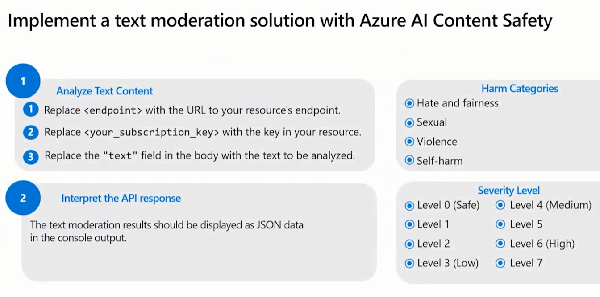

# [Preparing for AI-102 - Implement decision-support solutions (Part 2 of 6)](https://learn.microsoft.com/en-us/shows/exam-readiness-zone/preparing-for-ai-102-implement-decision-support-solutions)

## 2.1 Create decision support solutions for data monitoring and content delivery

### Implement a data monitoring solution with Azure AI Metrics Advisor

---

### Implement a text moderation solution with Azure AI Content Safety

---

### Implement an image moderation solution with Azure AI Content Safety

