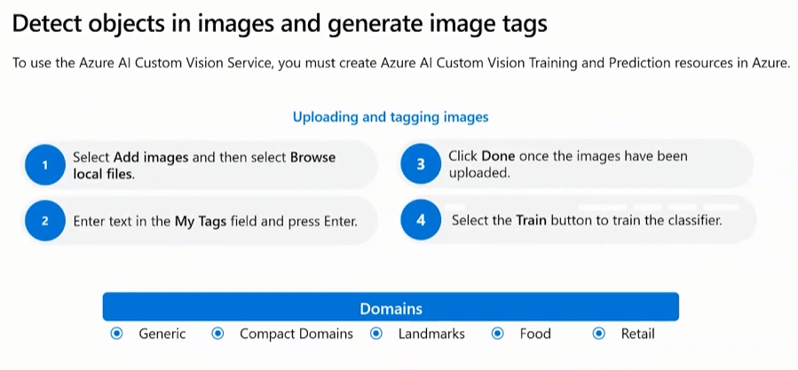
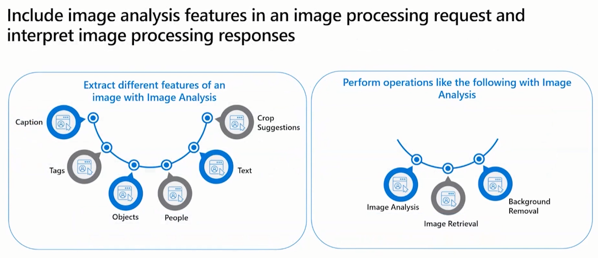
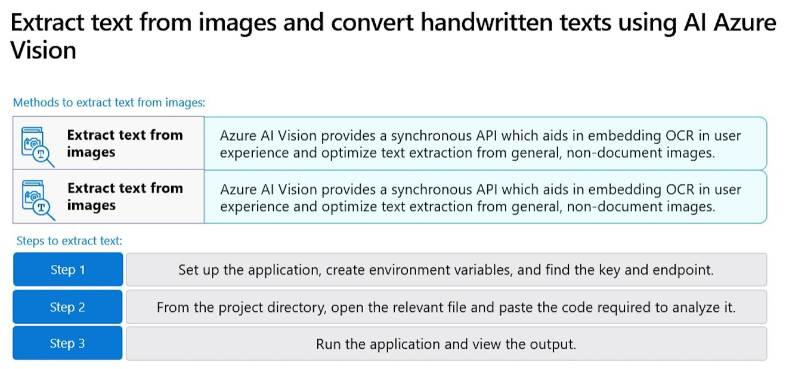
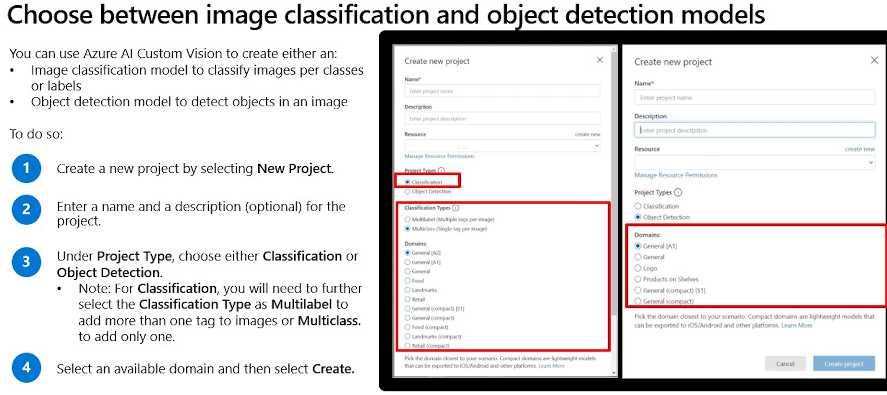
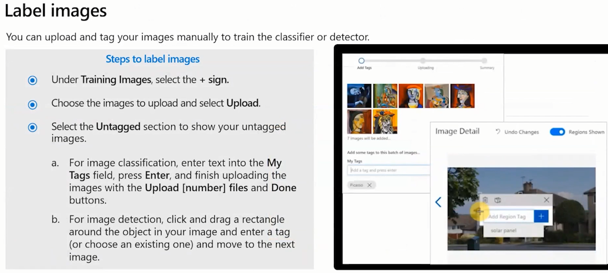
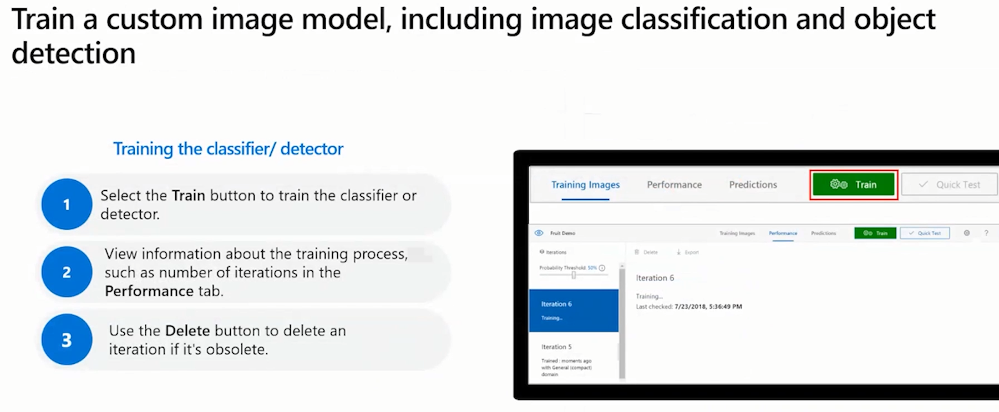
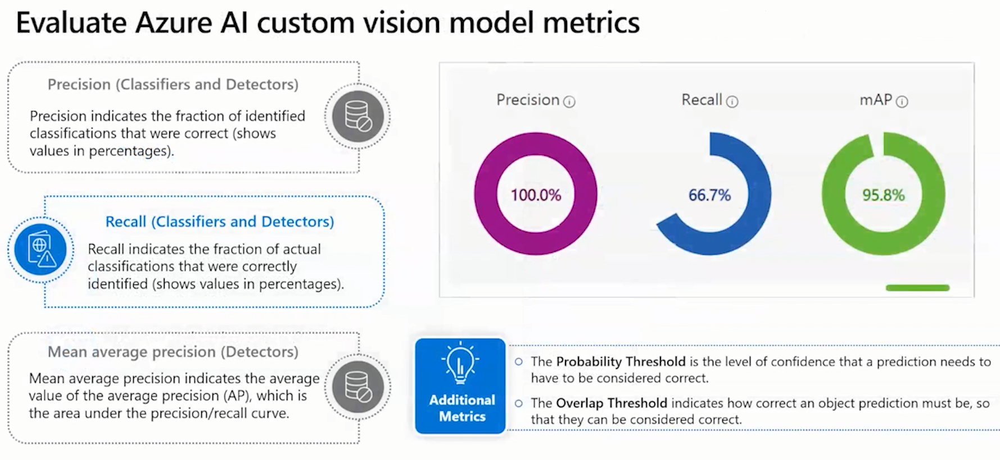
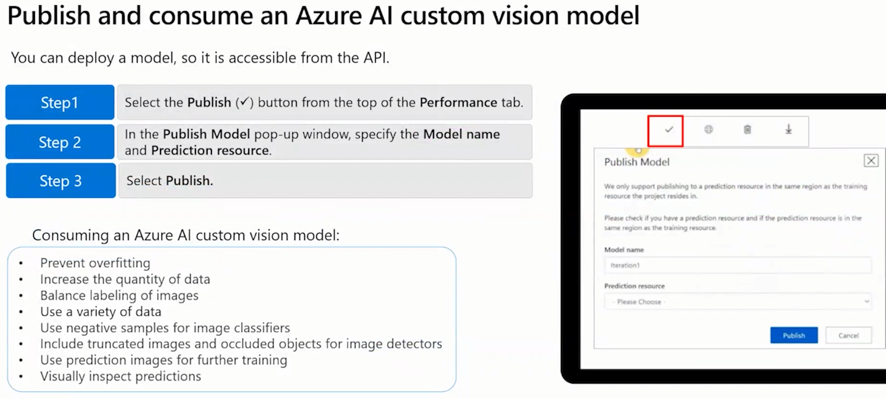
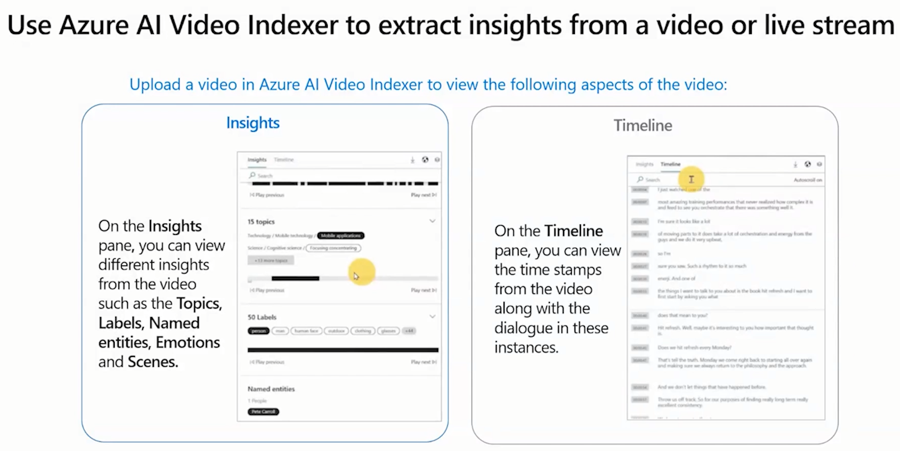
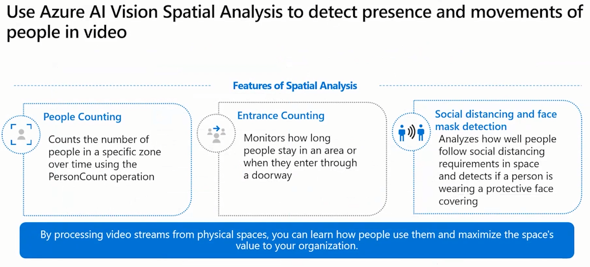

# [Preparing for AI-102 - Implement Azure AI vision solutions (Part 3 of 6)](https://learn.microsoft.com/en-us/shows/exam-readiness-zone/preparing-for-ai-102-implement-azure-ai-vision-solutions)

## [Exam outline](https://learn.microsoft.com/en-us/credentials/certifications/resources/study-guides/ai-102)

### 3.1 Analyze images
- Select visual features to meet image processing requirements
- Detect objects in images and generate image tags
- Include image analysis features in an image processing request
- Interpret image processing responses
- Extract text from images using Azure AI Vision
- Convert handwritten text using Azure AI Vision

### Implement custom vision models by using AI Vision

- Choose between image classification and object detection models
- Label images
- Train a custom image model, including image classification and object detection
- Evaluate custom vision model metrics
- Publish a custom vision model
- Consume a custom vision model
- Build a custom vision model code first

### Analyze videos
- Use Azure AI Video Indexer to extract insights from a video or live stream
- Use Azure AI Vision Spatial Analysis to detect presence and movement of people in video

---

## Select visual features to meet image processing requirements

The Azure AI Vision Image Analysis service can be used to extract several features from images.

- Retrieve image descriptions and tags
- Model customization
- Read text from image (OCR)
- Detect objects and people
- Generate image captions
- Identify and tag visual features in an image
- Smart crop
- Background removal

---

### Detect objects in images and generate image tags

---

### Include image analysis features in an image processing request and interpret image processing responses

---

### Extract text from images and convert handwritten texts using AI Azure Vision

- Synchronized
- Asynchronized

---

### Choose between image classification and object detection models

---

### Label images

---

### Evaluate Azure AI custom vision model metrics

- Precision
- Recall: actual classification
- Mean average precision (MAP) - Detection

---

### Publish and consume an Azure AI custom vision model

---

### Use Azure AI Video Indexer to extract insights from a video or live stream

---

### Use Azure AI Vision Spatial Analysis to detect presence and movements of people in video

