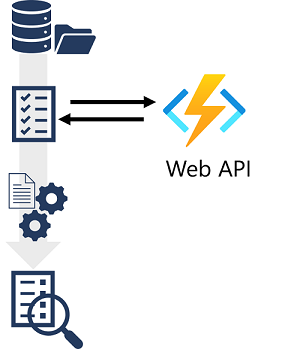
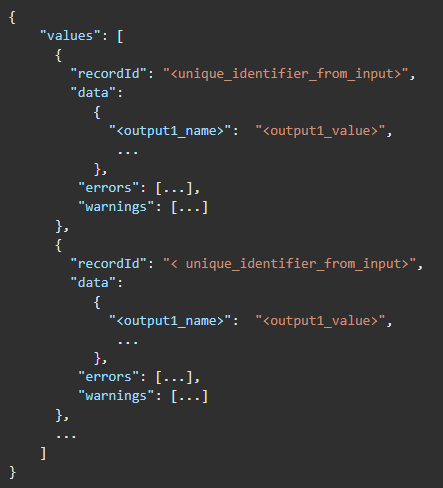
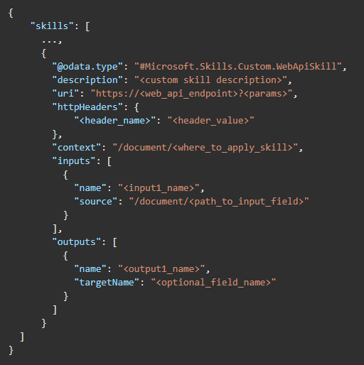
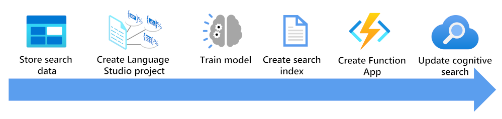
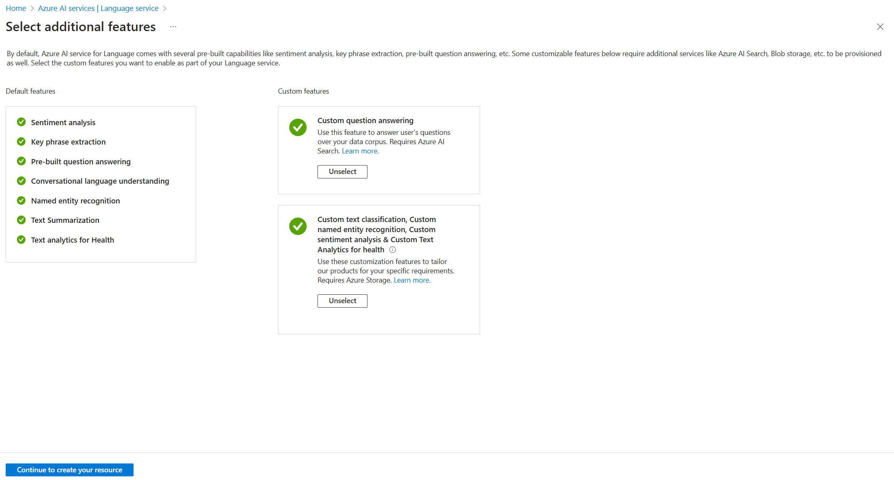
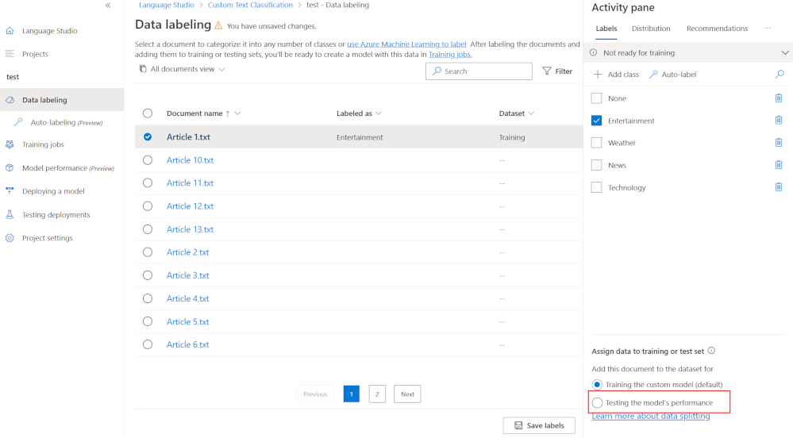
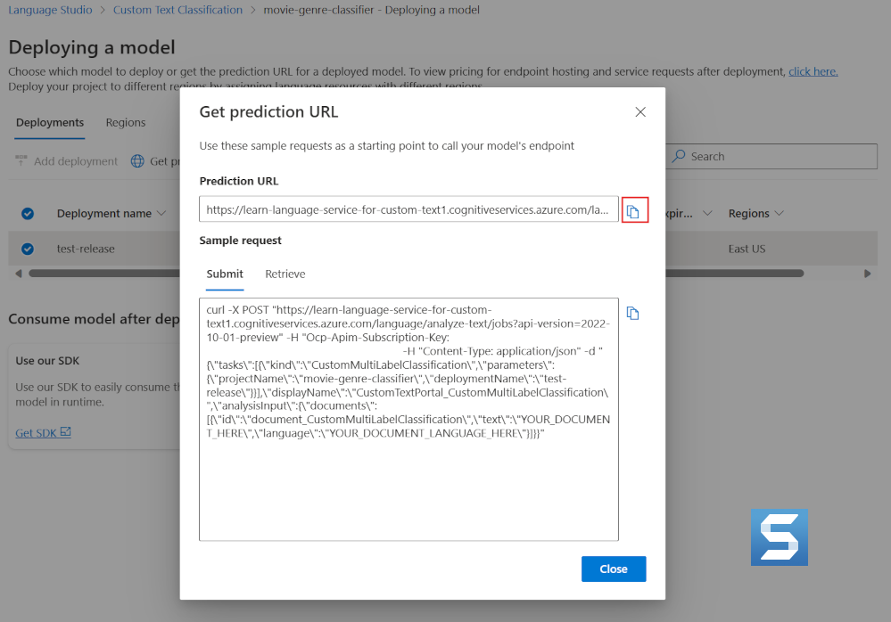
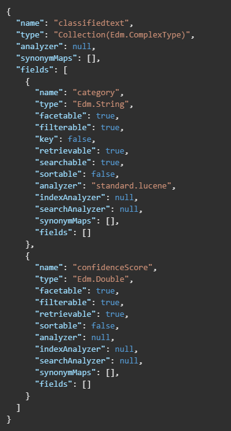
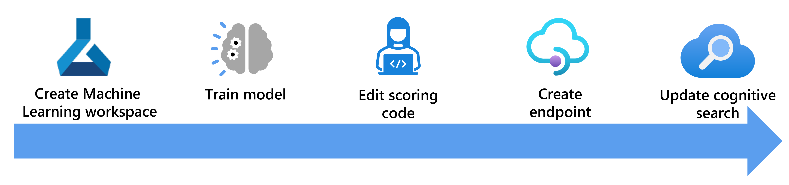
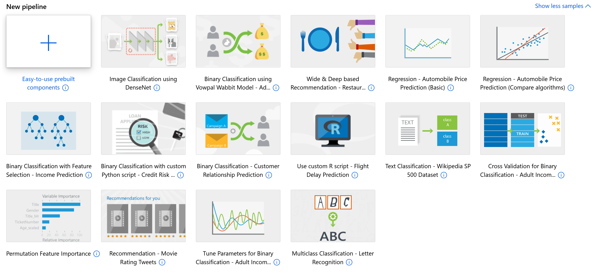

# [Create a custom skill for Azure AI Search](https://learn.microsoft.com/en-us/training/modules/create-azure-ai-custom-skill/)

Use the power of artificial intelligence to **enrich your data and find new insights with custom skills** in Azure AI Search.

## Learning objectives

In this module you'll learn how to:

- Implement a custom skill for Azure AI Search
- Create a **custom text classification skill**
- Create a **machine learning custom skill**

---

## Introduction

You can use the **predefined skills** in Azure AI Search to greatly **enrich an index by extracting additional information from the source data**. However, there may be occasions when you have *specific data extraction needs* that can't be met with the predefined skills and require some custom functionality.

For example:

- Integrate the Document Intelligence service to extract data from forms.
- Consume an Azure Machine Learning model to integrate predicted values into an index.
- Any other custom logic.

To support these scenarios, you can implement custom skills as web-hosted services (such as Azure Functions) that support the required interface for integration into a skillset.

In this module you'll learn how to:

- Implement a custom skill for Azure AI Search
- Integrate a custom skill into an Azure AI Search skillset
- Enrich a search index using a **custom text classification model**
- Enrich a search index with an **Azure Machine Learning custom skill**

> Note: This module assumes you already know how to create and use an Azure AI Search solution that includes built-in skills. If not, complete the [Create an Azure AI Search solution](https://learn.microsoft.com/en-us/training/modules/create-azure-cognitive-search-solution/) module first.

---

## [Define the custom skill schema](https://learn.microsoft.com/en-us/training/modules/create-azure-ai-custom-skill/2-define-custom-skill-schema)

Your custom skill must **implement the expected schema for input and output data** that is expected by skills in an Azure AI Search skillset.

### Input schema

The input schema for a custom skill defines **a JSON structure** containing **a record for each document to be processed**. Each document has **a unique identifier**, and **a data payload with one or more inputs**, like this:

### Output schema

The schema for the results returned by your custom skill reflects the input schema. It's assumed that **the output contains a record for each input record**, with either the results produced by the skill or details of any errors that occurred.

The output value in this schema is a property bag that can contain any JSON structure, reflecting the fact that index fields aren't necessarily simple data values, but can contain complex types.

---

## [Add a custom skill](https://learn.microsoft.com/en-us/training/modules/create-azure-ai-custom-skill/3-add-custom-skill)

To integrate a custom skill into your indexing solution, you must add a skill for it to a skillset using the `Custom.WebApiSkill` skill type.

The skill definition must:

- Specify the URI to your **web API endpoint**, including **parameters** and **headers** if necessary.
- Set the context to specify at which point in the document hierarchy the skill should be called.
- Assign input values, usually from existing document fields.
- Store output in a new field, optionally specifying **a target field name** (otherwise the output name is used).

Your skillset can include **both built-in skills and custom skills**, depending on your use case. The skills array seen in the above example will contain all of your skills, with the custom skills code running outside of the search service (as applicable) which we'll see in the exercise later in this module.

The following units explore specific kinds of custom skills through the use additional Azure resources.

---

## [Custom text classification skill](https://learn.microsoft.com/en-us/training/modules/create-azure-ai-custom-skill/4-custom-text-classification-skill)

**Custom text classification** allows you to *map a passage of text to different user defined classes*. For example, you could train a model on the synopsis on the back cover of books to automatically identify a books genre. You then use that identified genre to enrich your online shop search engine with a genre facet.

Here, you'll see what you need to consider to enrich a search index using a custom text classification model:

1. Store your documents so they can be accessed by Language Studio and Azure AI Search indexers.
2. Create a **custom text classification project**.
3. Train and test your model.
4. **Create a search index** based on your stored documents.
5. Create a function app that uses your deployed trained model.
6. Update your search solution, your **index, indexer, and custom skillset**.

### 1. Store your data

**Azure Blob storage** can be accessed from both Language Studio and Azure AI Services. The container needs to be accessible, so the simplest option is to choose Container, but it's also possible to use private containers with some additional configuration.

Along with your data, you also need a way to **assign classifications for each document**. Language Studio provides a graphical tool that you can use to classify each document one at a time manually.

You can choose between two different types of project. If a document maps to a single class use a **single label classification project**. If you want to map a document to more than one class, use the **multi label classification project**.

If you don't want to manually classify each document, you can label all your documents before you create your Azure AI Language project. This process involves creating a labels JSON document in this format:

You add as many classes as you have to the `classes` array. You add an entry for each document in the `documents` array including which classes the document matches.

### 2. Create your Azure AI Language project

There are two ways to create your Azure AI Language project. If you **start using Language Studio without first creating a language service in the Azure portal**, Language Studio will offer to create one for you.

The most flexible way to create an Azure AI Language project is to **first create your language service using the Azure portal**. If you choose this option, you get the option to add **custom features**.

As you are going to create a custom text classification, select that custom feature when creating your language service. You'll also link the language service to a storage account using this method.

Once the resource has been deployed, you can navigate directly to the Language Studio from the overview pane of the language service. You can then create a new custom text classification project.

> Note: If you have created your language service from Language Studio you might need to follow these steps. [Set roles for your Azure Language resource and storage account](https://learn.microsoft.com/en-us/azure/ai-services/language-service/custom-text-classification/how-to/create-project?tabs=azure-portal%2Cstudio%2Csingle-classification#set-roles-for-your-azure-language-resource-and-storage-account) to connect your storage container to your custom text classification project.

### 3. Train your classification model

As with all AI models, you need to have identified data that you can use to train it. The model needs to see examples of how to map data to a class and have some examples it can use to test the model. You can choose to **let the model automatically split your training data**, by default it will use **80% of the documents to train the model** and **20% to blind test it**. If you have some specific documents that you want to test your model with, you can label documents for testing.

In Language Studio, in your project, select **Data labeling**. You'll see all your documents. Select each document you'd like to add to the testing set, then select **Testing the model's performance**. Save your updated labels and then create a new training job.

### 4. Create search index

There isn't anything specific you need to do to create a search index that will be enriched by a custom text classification model. Follow the steps in [Create an Azure AI Search solution](https://learn.microsoft.com/en-us/training/modules/create-azure-cognitive-search-solution/). You'll be **updating the index, indexer, and custom skill after you've created a function app**.

### 5. Create an Azure function app

You can choose the **language and technologies** you want for your function app. The app needs to be able to **pass JSON to the custom text classification endpoint**, for example:

Then process the JSON response from the model, for example:

The function then returns a structured JSON message back to a custom skillset in AI Search, for example:

`[{"category": "Action", "confidenceScore": 0.99}, {"category": "Comedy", "confidenceScore": 0.96}]`

There are five things the function app needs to know:

1. The **text** to be classified.
2. The **endpoint** for your trained custom text classification deployed model.
3. The **primary key** for the custom text classification project.
4. The **project name**.
5. The **deployment name**.

The text to be classified is passed from your custom skillset in AI Search to the function as input. *The remaining four items can be found in Language Studio*.

The endpoint and deployment name is on the deploying a model pane.

The project name and primary key are on the project settings pane.

### 6. Update your Azure AI Search solution

There are three changes in the Azure portal you need to make to enrich your search index:

1. You need to **add a field to your index** to *store the custom text classification enrichment*.
2. You need to **add a custom skillset** to *call your function app with the text to classify*.
3. You need to **map the response** from the skillset into the index.

#### Add a field to an existing index

In the Azure portal, go to your AI Search resource, select the index and you'll add JSON in this format:

This JSON adds a compound field to the index to store the class in a `category` field that is searchable. The second `confidenceScore` field stores the confidence percentage in a double field.

#### Edit the custom skillset

In the Azure portal, select the skillset and add JSON in this format:

This `WebApiSill` skill definition specifies that the language and the contents of a document are passed as inputs to the function app. The app will return JSON text named `class`.

#### Map the output from the function app into the index

The last change is to map the output into the index. In the Azure portal, select the indexer and edit the JSON to have a new output mapping:

`{
  "sourceFieldName": "/document/class",
  "targetFieldName": "classifiedtext"
}`

The indexer now knows that the output from the function app `document/class` should be stored in the `classifiedtext` field. As this has been defined as a compound field, the function app has to return a JSON array containing a `category` and `confidenceScore` field.

You can now search an enriched search index for your custom classified text.

---

## Machine learning custom skill

Using a machine learning custom skill works the same as adding any other custom skill to a search index.

Here, you'll see how using the `AmlSkill` custom skill is different and explore the considerations of how to effectively use it.

### Custom Azure Machine Learning skill schema

When you enrich a search index with an **Azure Machine Learning (AML) custom skill**, the enrichment happens at the document level. The skillset used by your document indexer needs to include an `AmlSkill`. The schema for this skill is:

> Important: The URI has to use an HTTPS endpoint. This can either be a managed custom URL address provided by Microsoft or your own domain name and certificate.

Take note that the custom skill doesn't include settings for `batchSize` as the AML model will process a single document at a time. The remaining settings that control the performance of the skill are `timeout` and `degreeOfParallelism`. The above schema has set **30 seconds as the timeout value**. The **degree of parallelism should start at one**. Depending on your infrastructure, you might be able to increase this number.

The best way to manage the efficiency of an AML skill is to **scale up the Kubernetes inference cluster** appropriately to manage your workload.

The index for the document needs a field to store the results from the AML model. You'll then add an output field mapping to store the results from the custom skill set to the field on the document in the index.

The JSON to do this output field mapping is:

`"outputFieldMappings": [
    {
      "sourceFieldName": "/result field in the document",
      "targetFieldName": "result field from the AML model"
    }
  ]`

You create your Azure Machine Learning model using **developer tools like the Python SDK, REST APIs, or Azure CLI**. Another option is to take advantage of the **Azure AI Machine Learning studio**, a graphical user interface that lets you create, train, and deploy models without writing any code.

With a model created, you alter how the scoring code calls the model to allow it to be used by your custom search skill.

The last steps are to **create a Kubernetes cluster to host an endpoint for your model**.

### Create an AML workspace

When you create the AML workspace, Azure will also create **storage accounts, a key store, and application insights resources**. The AML workspace Overview pane gives you a link to launch the Azure AI Machine Learning Studio.

#### Create and train a model in Azure Machine Learning studio

Azure AI Machine Learning Studio lets you use a designer to use drag and drop to create pipelines that create and train models. There's an even easier way to create models by using prebuilt templates.

However you choose to create your models, they need to be registered in Azure AI Machine Learning Studio so that you can deploy the model to a web service.

#### Alter how the model works to allow it to be called by the AML custom skill

The models you train will normally use many examples of the data. The datasets will have many rows and be split and used to train and test the model. The code that handles this data and passes it to the model needs to be changed to handle single rows.

The JSON response from the model should also contain only the output prediction.

For example, if your data is an array of JSON objects:

`[ 
    {
        "attribute-1": null,
        "attribute-2": null
    },
    {
        "attribute-1": null,
        "attribute-2": null
    },
    {
        "attribute-1": null,
        "attribute-2": null
    }
]`

The python scoring code will have to process the data a row at a time:

`data = json.loads(data)
for row in data:
    for key, val in row.items():
        input_entry[key].append(decode_nan(val))`

To change the input dataset to a single record:

`{
    "attribute-1": null,
    "attribute-2": null
}`

The python code will need to change to:

`data = json.loads(data)`
`for key, val in data.items():
    input_entry[key].append(decode_nan(val))`

For the response from the scoring code, the default code returns the whole JSON document:

`return json.dumps({"result": result.data_frame.values.tolist()})`

The custom skill needs to be able to map a single response from the model. So the code should return JSON that is only the last attribute.

`output = result.data_frame.values.tolist()`
`# return the last column of the the first row of the dataframe`
`return {
    "predicted_outcome": output[0][-1]
}`

#### Create an endpoint for your model to use

The model is deployed to an endpoint. Azure AI Machine Learning Studio supports deploying a model to **a real-time endpoint, a batch endpoint, or a web service**. At the moment, the custom `AmlSkill` skill in Azure AI Search **only supports web service endpoints**.

The other restriction is that **the endpoint has to be an Azure Kubernetes Service (AKS) cluster**. Container instances aren't supported.

If you have experience in creating and managing AKS clusters, you can manually create the clusters in the Azure portal and reference them when you create your endpoint. However, an easier option is to let Azure AI Machine Learning Studio create and manage the cluster for you.

If you navigate to the compute section of the studio, you can create inference clusters. AML studio will then guide you through choosing the size of the cluster and even enable HTTPS and create a domain name for you. It will be in the format of location.cloudapp.azure.com:443.

#### Connect the AML custom skill to the endpoint

With everything above in place, you need to update your Azure AI Search service. The steps to do so are similar to examples shown in this module, so we won't detail the specifics here but will list out the steps to follow.

1. First, to enrich your search index you'll add a new field to your index to include the output for the model.
2. Then you'll update your index skillset and add the `#Microsoft.Skills.Custom.AmlSkill` custom skill.
3. Next, you'll change your indexer to map the output from the custom skill to the field you created on the index.
4. The last step is to rerun your indexer to enrich your index with the AML model.

---

## [Exercise - Create a Custom Skill for Azure AI Search](https://learn.microsoft.com/en-us/training/modules/create-azure-ai-custom-skill/6-exercise)

In this exercise, you'll try out some of the techniques you've learned about in this module to build a custom skill for an AI Search solution.

### [Create a Custom Skill for Azure AI Search](https://microsoftlearning.github.io/mslearn-knowledge-mining/Instructions/Exercises/02-search-skills.html)

Azure AI Search uses an enrichment pipeline of AI skills to extract AI-generated fields from documents and include them in a search index. There’s a comprehensive set of built-in skills that you can use, but if you have a specific requirement that isn’t met by these skills, you can create a custom skill.

In this exercise, you’ll create a custom skill that tabulates the frequency of individual words in a document to generate a list of the top five most used words, and add it to a search solution for Margie’s Travel - a fictitious travel agency.

---

## Module assessment

1. You want to include a sentiment score for each document in an index. What should you do? **Add the built-in sentiment skill to the skillset used by the indexer**.
2. You implemented a custom skill as an Azure function. You want to include the custom skill in your Azure AI Search indexing process. What should you do? **Add a WebApiSkill to a skillset, referencing the Azure function's URI**.
3. When you create an Azure AI Language project, if you let the model automatically split your training data, what percentage of the documents will it use to train the model, by default? **80%**
4. When you create an Azure Machine Learning custom skill, what type of endpoint does the URI have to use? **The URI has to use an HTTPS endpoint**.

---

## Summary

In this module, you learned how to **implement a custom skill for an Azure AI Search solution**.

**Custom skills can enrich your index in various ways**, such as with *custom Language models, machine learning, or document intelligence*.

Custom skills prevents consumers of your Azure AI Search service from having to do repetitive processing or multiple service calls. This optimization saves both time and cost while delivering a better solution for search.

For more information about Azure AI Search, take a look at the [service documentation](https://learn.microsoft.com/en-us/azure/search/).